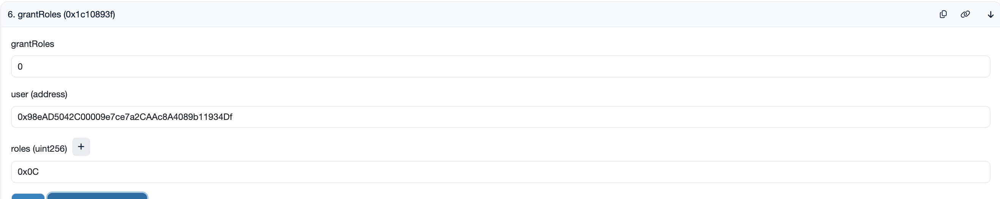
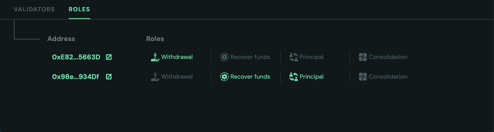
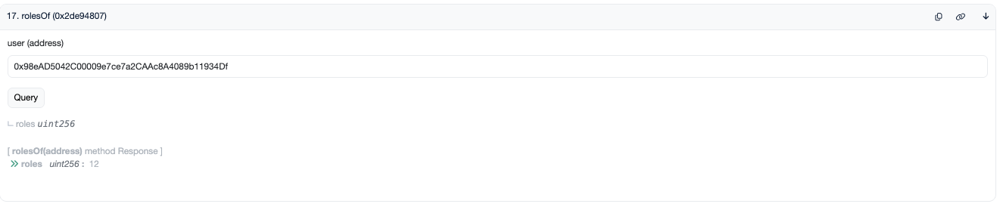
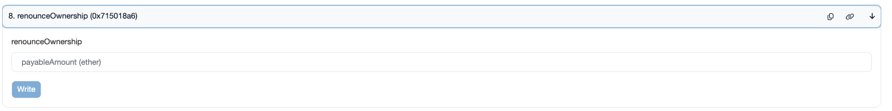

# How to Assign Roles to Addresses in OVM

This guide explains how to assign permissions within the Obol Vault Manager (OVM) smart contract using the efficient bitwise role system and includes crucial security recommendations.

---

## 1. Understanding the Bitwise Role System

The OVM contract manages permissions by assigning each role a unique power-of-two value (a single binary bit). To grant multiple roles, you simply add (or bitwise OR) their values together to produce a single, final integer that the smart contract reads.

### Contract Role Definitions

| Role Name | Decimal Value | Hex Value | Primary Purpose |
| --- | --- | --- | --- |
| **`WITHDRAWAL_ROLE`** | 1 | `0x01` | Initiate validator withdrawals/claims. |
| **`CONSOLIDATION_ROLE`** | 2 | `0x02` | Initiate validator consolidation (migration). |
| **`SET_BENEFICIARY_ROLE`** | 4 | `0x04` | Set/change the principal/withdrawal address. |
| **`RECOVER_FUNDS_ROLE`** | 8 | `0x08` | Emergency recovery of stuck assets. |
| **`SET_REWARD_ROLE`** | 16 | `0x10` | Set/change the reward fee recipient address. |
| **`DEPOSIT_ROLE`** | 32 | `0x20` | Submit validator deposit data. |

## 2. Guide to Assigning and Managing Roles

The easiest way to generate the required hex code is by using the dedicated calculator tool.

### Step 1: Find the Hex Code (Using the Calculator)

Use the following interactive tool to instantly find the code for your required role combination:

- **[OVM Roles Calculator](https://dazzling-genie-4aaac7.netlify.app/)**

1. **Select Roles:** Go to the calculator and click the **Checkboxes** for all the roles you need to grant.
2. **Retrieve Code:** The calculator will automatically calculate and display the final **Total Hex Code** (e.g., `0x11`) and **Total Decimal Code** (e.g., 17). Use the **Total Hex Code** in the next stage.

### Step 2: Assign the Roles On-Chain

Roles are assigned using the **`grantRoles`** function on the OVM smart contract.

1. **Go to Etherscan:** Navigate to the Block Explorer page for your deployed OVM smart contract.
2. **Access Write Contract:** Click the **"Contract"** tab, and then the **"Write Contract"** sub-tab.
3. **Connect Wallet:** Click **"Connect to Web3"** and connect the wallet that currently holds **ownership** of the OVM contract.
4. **Execute `grantRoles`:**
    - Find the function **`grantRoles`**.
    - **`user (address)`:** Enter the wallet address you want to grant permissions to (this is the target operator's address).
    - **`roles (uint256)`:** Input the **Decimal Value** (e.g., `17`) or **Hex Value** (e.g., `0x11`) copied from the calculator.
    - Click **"Write"** and approve the transaction.

<figure><figcaption></figcaption></figure>

## 3. Review the Roles

1. Assigned roles will show up in the launchpad to the designated address.

<figure><figcaption></figcaption></figure>

2. Sometimes launchpad might take some time to get the roles due to RPC issues. Try refreshing if this occurs. You can also use Etherscan directly to confirm roles.

<figure><figcaption></figcaption></figure>

## 4. Security and Recommendations 🔒

The security of the cluster relies entirely on the assignment and control of these roles. Follow these best practices:

### A. Principle of Least Privilege

- **Avoid `0x3F` (All Roles):** Never grant the full combination code (`0x3F` or 63) to any address that doesn't absolutely require it (like the primary owner/governance multi-sig).
- **Role Separation:** Grant only the specific roles an operator needs for their job. For example:
    - A technical operator managing deposits/withdrawals needs `WITHDRAWAL_ROLE` (1), `CONSOLIDATION_ROLE` (2), and `DEPOSIT_ROLE` (32).
    - A separate, highly-trusted governance multi-sig should hold **high-privilege roles** like `SET_BENEFICIARY_ROLE` (4), `SET_REWARD_ROLE` (16), and `RECOVER_FUNDS_ROLE` (8).

### B. Ownership & Trust

- **Secure the Owner:** The address that can call `grantRoles` and `revokeRoles` is the most powerful. This address **must be a hardware wallet or, ideally, a Gnosis SAFE multi-sig wallet.**
- **Cluster Creation Timing:** It is recommended to **grant final roles before sharing cluster invites** with external invitees. This ensures the security model is locked down before the cluster scales.
- **Renounce Ownership (Conditional):** If the cluster's roles are intended to be fixed forever (e.g., in a fully immutable system), you can **renounce ownership** after setting the final roles. However, if any role needs to be modifiable later (like changing the fee recipient), the owner must retain the ability to execute `grantRoles`.

<figure><figcaption></figcaption></figure>

## 5. Miscellaneous: How does Bitwise Logic Work?

The final Hex Code is generated by the **Bitwise OR** operation. Since every role value is a unique power of two, the code for any combination is simply the sum of the desired decimal values.

| Role Combination Requested | Decimal Addition | Bitwise OR (Binary) | Final Hex Code |
| --- | --- | --- | --- |
| **WITHDRAWAL** and **DEPOSIT** | 1+32=33 | `000001` \| `100000` = `100001` | **`0x21`** |
| **CONSOLIDATION** and **SET_REWARD** | 2+16=18 | `000010` \| `010000` = `010010` | **`0x12`** |
| **All 4 Basic Roles** | 1+2+4+8=15 | `000001` \| `000010` \| `000100` \| `001000` = `001111` | **`0x0F`** |
