# Operator Rotation

### Introduction to Operator Rotation using Pectra Validator Consolidation

Validator consolidation is a new feature for the Ethereum network, introduced with the last **Pectra** network upgrade. It allows a user to "consolidate" multiple validators into a single, new validator.

- Consolidations can only be performed when the source validator has 0x01 or 0x02 withdrawal credentials and the target validator must be 0x02. The consolidation transaction must be sent from the withdrawal address defined in the source credentials. The target withdrawal credentials can be any address of choice.
- This process transfers the staked ETH from the old validators to the new one while the stake never leaves the beacon chain. The only partial downtime for the source validator is the standard 27-hour waiting period on the beacon chain before the withdrawal. When compared to fully exiting and re-depositing, consolidation avoids the sweep delay required in that option.

> [!NOTE]
> Future direction (in development): We’re building toward full cluster mutability so operators can react quickly to real-world events. That includes resharing fresh key material across the cluster if there’s ever a security concern, adding new operators to reach full Byzantine fault tolerance, and removing operators who aren’t meeting performance expectations. The goal is to make these changes possible without exiting or consolidating validators. The forthcoming tooling will guide the cluster through a coordinated workflow and produce a fresh set of operator files ready for cutover when you’re comfortable switching over.
---

### Guide: Operator Rotation in an Obol Cluster via Validator Consolidation

Validator consolidation enables a safe and efficient way to perform operator rotation in an Obol cluster. This is achieved by transferring staked ETH directly from a **source cluster** (source validators with its original operators) to a **target cluster** (target validators with a new set of operators). Operator rotation can be classified into several different scenarios:

- Source and target cluster validators have the same withdrawal address that is an EOA (wallet address) or a Safe contract.
- Source and target cluster validators have different withdrawal addresses but they are still EOAs.
- Source and target cluster validators have the same OVMs as withdrawal addresses.
- Source and target cluster validators have different OVMs as withdrawal addresses. Source can be an OVM and withdrawal can be an EigenPod/EOA/Safe or vice versa.

In this guide, we focus on source and target validators that have the same withdrawal address that is an EOA or Safe. The other scenarios are actively in development.

**Pros:**

- Compared to the Charon native operator rotation, which requires technical knowledge of node operation, must be executed by operators, and is risky for key security when not done properly, consolidation-based operator rotation can be performed by a withdrawal address (who can be a non-operator such as an ETH allocator).
- Very minimal downtime of ~27 hours (256 epochs) on the stake with source validators. Missed rewards are estimated to be around 0.00296 ETH per validator.

**Cons:**

- If the number of validators is very high, even a single day of downtime (even though small) can add up.
- Target validators need to be active. This requires an additional 32 ETH for each target validator the cluster wishes to set up.

This document outlines the step-by-step process for rotating operators in an Obol DVT cluster using the new validator consolidation feature. This guide assumes you are starting with a source cluster with four existing operators and want to consolidate their validators into a new target cluster with four new operators.

### 1. Prepare the Target Cluster

- **Create a New Cluster:** As the user, first create a new Obol cluster for four new operators of your choice. More details can be found [here](../../run-a-dv/start/create-a-dv-with-a-group.md).
- **Set Withdrawal Address:** Set the withdrawal address for this new cluster to be the same EOA address you used for the source cluster. In future this can be changed to a withdrawal address of your choice.
- **Deploy a New Splitter:** Deploy a new splitter contract dedicated to the new operators of the target cluster.
- **Configure Validators:** Ensure the validators in the new cluster are configured as **compounding validators** with the `0x02` credential type. To enable this make sure to turn the compound toggle on or use the `--compounding` flag if using the CLI directly.

<figure>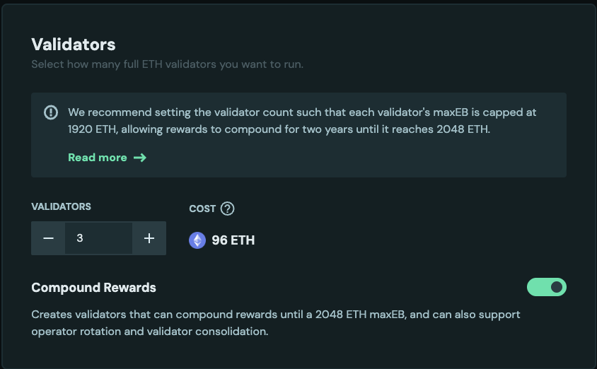<figcaption></figcaption></figure>

- **Run Nodes:** Start the Charon nodes for all operators in the new target cluster. Make sure all the nodes are healthy and ready for deposits. More details [here](../../run-a-dv/running/monitoring.md).
- **Activate Validators:** Activate the target validators by depositing 32 ETH for each. More details [here](../../run-a-dv/running/activate-a-dv.md). The image shows a new operator `0x493...9b1`.

<figure>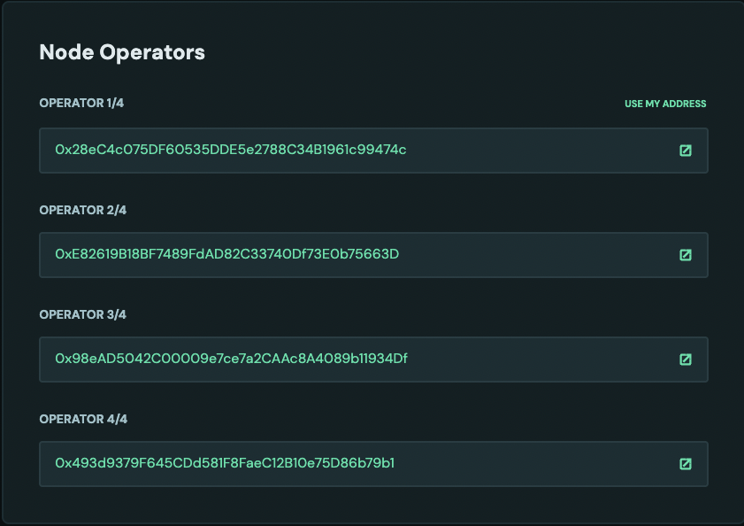<figcaption></figcaption></figure>

### 2. Finalize the Source Cluster

- Have a source cluster ready. Make sure you are connected with the correct withdrawal address. In this case, the operator [`0x28eC4c075DF60535DDE5e2788C34B1961c99474c`](https://hoodi.launchpad.obol.org/operator/0x28eC4c075DF60535DDE5e2788C34B1961c99474c/) is also the withdrawal address.

<figure>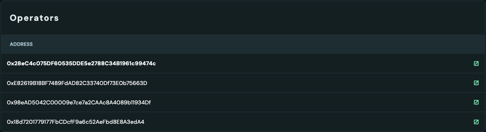<figcaption></figcaption></figure>

<figure><figcaption></figcaption></figure>

- **Distribute Rewards:** Before proceeding, distribute all pending rewards from the source cluster's splitter contract to ensure all financial obligations are settled with the original operators. The rewards should be 0 after rewards are distributed and claimed.

<figure>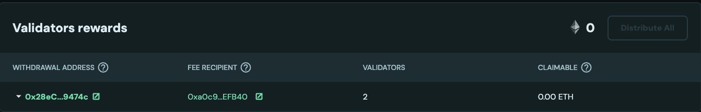<figcaption></figcaption></figure>

### 3. Initiate the Consolidation

- **Access the Migration Tool:** Navigate to the Obol Launchpad migration page by using a URL such as `https://hoodi.launchpad.obol.org/migrate/?withdrawalAddress=your_withdrawal_address`. Alternatively, click the **Migrate** button on a target validator's page within the target cluster dashboard. This **Migrate** button is only clickable for validators where the connected address is the withdrawal address. Make sure the correct address is connected.

<figure>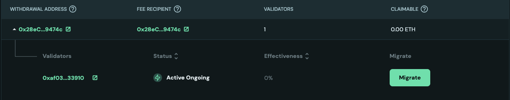<figcaption></figcaption></figure>

- **Select Validators:** On the migration page, select the source validators from the original cluster that you wish to consolidate.

- **Confirm and Consolidate:** Click the **Migrate** button to send the consolidation request.

<figure>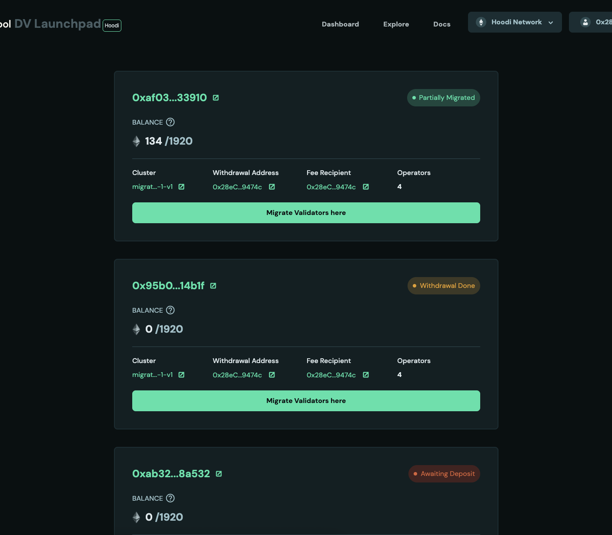<figcaption></figcaption></figure>

### 4. Post-Consolidation Actions

> [!INFO]
> Screenshots are for reference only, your validator balances and performance will differ.

- **Source Validator Exit:** Once the consolidation request is processed by the Ethereum network, the source validators will be set to exit automatically. On [beaconcha.in](https://beaconcha.in) the validator pubkey will show an **exiting** status with consolidation in progress.

<figure>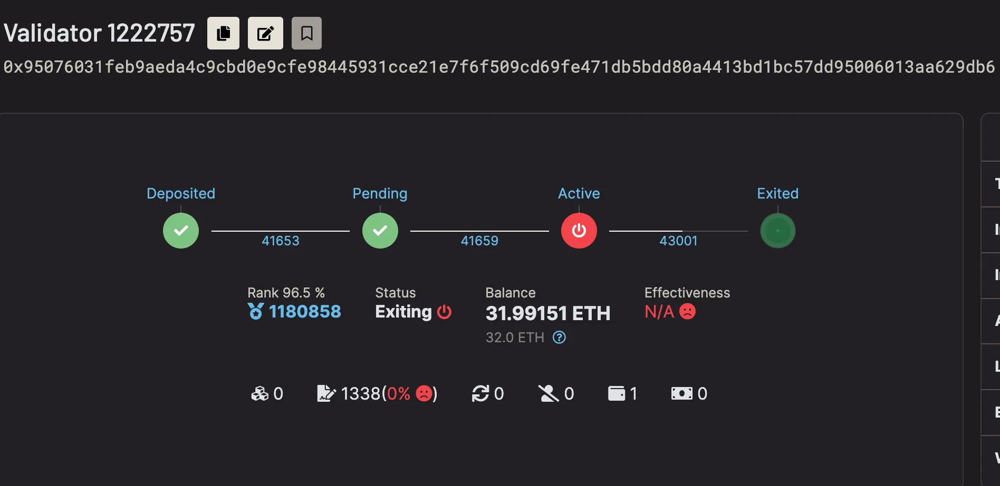<figcaption></figcaption></figure>

<figure>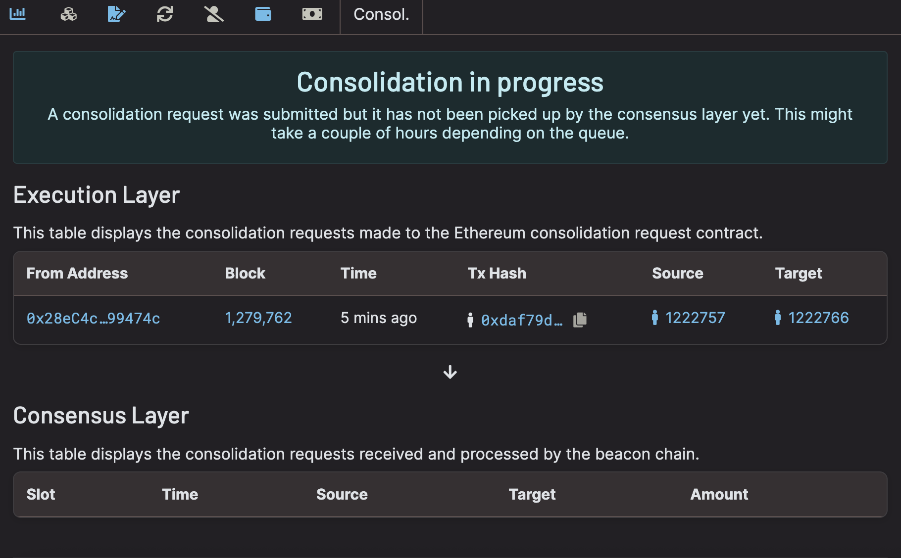<figcaption></figcaption></figure>

- **Waiting Period:** After the exit is complete, the validator enters a ~27 hour waiting period (256 epochs). In the example below the validator is marked **exited** while the withdrawable epoch remains in the future (43257). Once the withdrawable epoch is reached, ETH will be consolidated to the target validator.

<figure>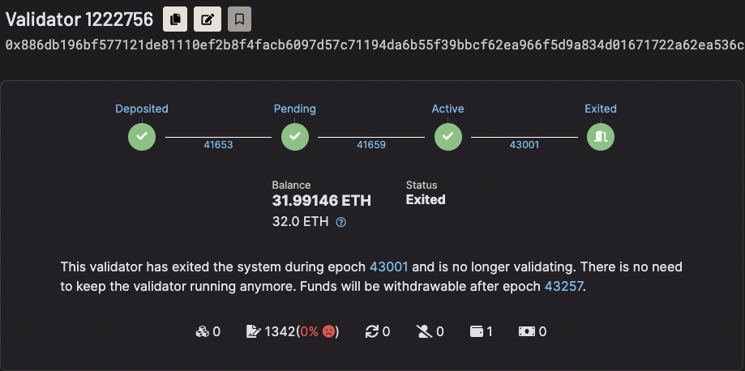<figcaption></figcaption></figure>

- **ETH Transfer:** After the waiting period, the staked ETH from the source validators is automatically consolidated and credited to the target validators in the new cluster.

<figure>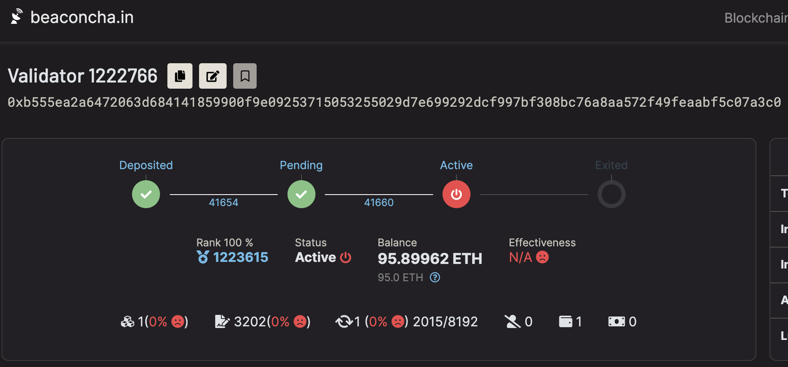<figcaption></figcaption></figure>

- **Wind Down Source Clusters:** Once the source validators have fully exited and funds have settled with the target cluster, you can wind down the original operators.

<figure>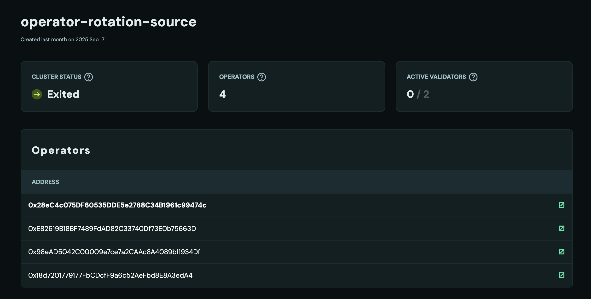<figcaption></figcaption></figure>

This process ensures a seamless and secure operator rotation, leveraging the efficiency of validator consolidation to minimize downtime and avoid a lengthy manual withdrawal process.

**Example clusters used in screenshots:**

- Target cluster: [0x15d1…9e32](https://hoodi.launchpad.obol.org/cluster/details/?lockHash=0x15d113c8c3e3ca1ec24bbdd5c5d8f9065c36f07d9d70c13e9a4efba8a35b9e32)
- Source cluster: [0xF321…2885](https://hoodi.launchpad.obol.org/cluster/details/?lockHash=0xF321443022ABA165FF5635CF71DC9DA0FC29EE91D03117055E97A1F92B5C2885)
