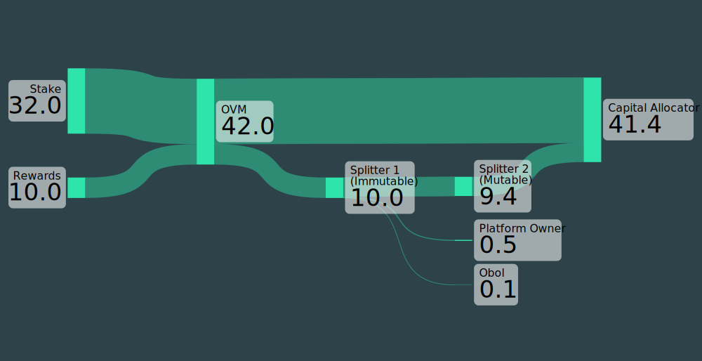

# OVM Contract Pre-Deploy Workflow

In some cases, it's desirable to set up an [Obol Validator Manager](../../learn/intro/obol-splits.md#obol-validator-managers) (OVM) contract in advance. For example, a professional staking business could provision and deploy an Obol DV cluster with unfunded validators managed by an OVM contract. When a capital allocator wishes to stake ETH, the OVM contract can quickly have control transferred to the stake owner who can then fund the validators through the contract. This eliminates downtime related to cluster allocation, providing "ready-to-go" staking with Obol DVs.

This guide will demonstrate the key steps in deploying and configuring an OVM contract for this type of scenario. The Hoodi testnet will be used for all examples.
<figure><figcaption></figcaption></figure>

The following code snippets are minimal examples for the purpose of showing how to achieve the desired functionality. These should not be run in production systems and are for illustrative purposes only.


### Contract Deployment
A safe and convenient way to deploy an OVM contract is through the [existing contract factory](https://docs.obol.org/next/learn/readme/obol-splits#obol-validator-manager-factory-deployment). 


```sh
import { createWalletClient, createPublicClient, http, parseAbi, parseEventLogs } from "viem";
import { privateKeyToAccount } from "viem/accounts";
import { hoodi } from "viem/chains";

// Factory contract address (already deployed)
const FACTORY_ADDRESS = "0x5754C8665B7e7BF15E83fCdF6d9636684B782b12";

// Minimal ABI for the factory - just what we need to deploy and parse events
const factoryAbi = parseAbi([
  "function createObolValidatorManager(address owner, address beneficiary, address rewardRecipient, uint64 principalThreshold) external returns (address ovm)",
  "event CreateObolValidatorManager(address indexed ovm, address indexed owner, address beneficiary, address rewardRecipient, uint64 principalThreshold)",
]);

// Set up account from private key
const account = privateKeyToAccount("0x...");

// Create a wallet client for sending transactions
const walletClient = createWalletClient({
  account,
  chain: hoodi,
  transport: http("https://ethereum-hoodi-rpc.publicnode.com"),
});

// Create a public client for reading chain data (receipts, logs)
const publicClient = createPublicClient({
  chain: hoodi,
  transport: http("https://ethereum-hoodi-rpc.publicnode.com"),
});

// Deploy the ObolValidatorManager via the factory
const hash = await walletClient.writeContract({
  address: FACTORY_ADDRESS,
  abi: factoryAbi,
  functionName: "createObolValidatorManager",
  args: [
    "0xOwnerKeyAddress",
    "0xOwnerKeyAddress",
    "0xOwnerKeyAddress",
    16_000_000_000n, // 16 ETH in gwei (recommended principal threshold)
  ],
});

console.log("Transaction submitted:", hash);

// Wait for the transaction to be confirmed and get the receipt
const receipt = await publicClient.waitForTransactionReceipt({ hash });

// Parse the logs to find the CreateObolValidatorManager event
const logs = parseEventLogs({
  abi: factoryAbi,
  logs: receipt.logs,
  eventName: "CreateObolValidatorManager",
});

// Extract the deployed OVM address from the event
const ovmAddress = logs[0].args.ovm;

console.log("ObolValidatorManager deployed at:", ovmAddress);
```


```sh
cast send 0x5754C8665B7e7BF15E83fCdF6d9636684B782b12 \
  "createObolValidatorManager(address,address,address,uint64)" \
  0xOwnerKeyAddress 0xOwnerKeyAddress 0xOwnerKeyAddress 16000000000 \
  --rpc-url https://ethereum-hoodi-rpc.publicnode.com \
  --private-key 0x...
```


```sh
// SPDX-License-Identifier: MIT
pragma solidity ^0.8.19;

import {Script, console} from "forge-std/Script.sol";

interface IObolValidatorManagerFactory {
    function createObolValidatorManager(
        address owner,
        address beneficiary,
        address rewardRecipient,
        uint64 principalThreshold
    ) external returns (address ovm);
}

contract DeployOVM is Script {
    // Factory contract address (already deployed)
    address constant FACTORY_ADDRESS = 0x5754C8665B7e7BF15E83fCdF6d9636684B782b12;

    function run() external {
        vm.startBroadcast();

        // Deploy the ObolValidatorManager via the factory
        address ovm = IObolValidatorManagerFactory(FACTORY_ADDRESS).createObolValidatorManager(
            0xOwnerKeyAddress,        // owner
            0xOwnerKeyAddress,        // beneficiary (receives principal)
            0xOwnerKeyAddress,        // rewardRecipient (receives rewards)
            16_000_000_000            // 16 ETH in gwei (recommended principal threshold)
        );

        console.log("ObolValidatorManager deployed at:", ovm);

        vm.stopBroadcast();
    }
}
```


### Granting OVM Roles

Next, OVM contract privileges can be reduced to only those necessary for later stages of deployment. While not strictly necessary, this allows for the distribution of less privileged account private keys to lower security layers of infrastructure. For example, an API backend could have access to certain less-sensitive contract functions to unlock utility without the owner key being exposed during everyday operations. The [SET_BENEFICIARY_ROLE](../../learn/intro/obol-splits.md#roles) can be used later to update the recipient of the principal deposit to the actual depositor, while the `WITHDRAWAL_ROLE` will be used to process withdrawal requests.


```sh
import { createWalletClient, createPublicClient, http, parseAbi } from "viem";
import { privateKeyToAccount } from "viem/accounts";
import { hoodi } from "viem/chains";

// The deployed OVM address
const OVM_ADDRESS = "0xYourOVMAddress";

// The address to grant roles to
const GRANTEE_ADDRESS = "0xLessPrivilegedKeyAddress";

// Role bitmasks from the contract
const WITHDRAWAL_ROLE = 0x01n;
const SET_BENEFICIARY_ROLE = 0x04n;

// Combine roles using bitwise OR
const ROLES_TO_GRANT = WITHDRAWAL_ROLE | SET_BENEFICIARY_ROLE; // 0x05

const ovmAbi = parseAbi([
  "function grantRoles(address user, uint256 roles) external payable",
]);

const account = privateKeyToAccount("0x...");

const walletClient = createWalletClient({
  account,
  chain: hoodi,
  transport: http("https://ethereum-hoodi-rpc.publicnode.com"),
});

const publicClient = createPublicClient({
  chain: hoodi,
  transport: http("https://ethereum-hoodi-rpc.publicnode.com"),
});

// Grant both roles in a single transaction
const hash = await walletClient.writeContract({
  address: OVM_ADDRESS,
  abi: ovmAbi,
  functionName: "grantRoles",
  args: [GRANTEE_ADDRESS, ROLES_TO_GRANT],
});

console.log("Grant roles tx:", hash);
await publicClient.waitForTransactionReceipt({ hash: hash });

console.log("Granted WITHDRAWAL_ROLE and SET_BENEFICIARY_ROLE to:", GRANTEE_ADDRESS);
```


```sh
cast send 0xYourOVMAddress \
  "grantRoles(address,uint256)" \
  0xLessPrivilegedKeyAddress 5 \
  --rpc-url https://ethereum-hoodi-rpc.publicnode.com \
  --private-key 0x...
```


```sh
// SPDX-License-Identifier: MIT
pragma solidity ^0.8.19;

import {Script, console} from "forge-std/Script.sol";

interface IObolValidatorManager {
    function grantRoles(address user, uint256 roles) external payable;
}

contract GrantRoles is Script {
    address constant OVM_ADDRESS = 0xYourOVMAddress;
    address constant GRANTEE_ADDRESS = 0xLessPrivilegedKeyAddress;

    // Role bitmasks from the contract
    uint256 constant WITHDRAWAL_ROLE = 0x01;
    uint256 constant SET_BENEFICIARY_ROLE = 0x04;

    function run() external {
        vm.startBroadcast();

        // Grant both roles in a single transaction using bitwise OR
        IObolValidatorManager(OVM_ADDRESS).grantRoles(
            GRANTEE_ADDRESS,
            WITHDRAWAL_ROLE | SET_BENEFICIARY_ROLE
        );

        console.log("Granted roles to:", GRANTEE_ADDRESS);

        vm.stopBroadcast();
    }
}
```


At this point, the contract is ready to be personalized. When staking services are requested by a capital allocator, the OVM contract can be assigned and validator initialization can proceed.

### Assigning the Contract

When the capital allocator is identified, the contract can be assigned to that entity. The principal beneficiary is updated to the entity's address and privileges are dropped by the secondary key created previously (as needed). This prevents further changes of the beneficiary by that key.


```sh
import { createWalletClient, createPublicClient, http, parseAbi } from "viem";
import { privateKeyToAccount } from "viem/accounts";
import { hoodi } from "viem/chains";

// The deployed OVM address
const OVM_ADDRESS = "0xYourOVMAddress";

// The customer address to receive principal deposits
const CUSTOMER_ADDRESS = "0xCustomerAddress";

// Role bitmask
const SET_BENEFICIARY_ROLE = 0x04n;

const ovmAbi = parseAbi([
  "function setBeneficiary(address newBeneficiary) external",
  "function renounceRoles(uint256 roles) external payable",
]);

// Use the secondary key that was granted SET_BENEFICIARY_ROLE
const account = privateKeyToAccount("0xLessPrivilegedKey...");

const walletClient = createWalletClient({
  account,
  chain: hoodi,
  transport: http("https://ethereum-hoodi-rpc.publicnode.com"),
});

const publicClient = createPublicClient({
  chain: hoodi,
  transport: http("https://ethereum-hoodi-rpc.publicnode.com"),
});

// Set the beneficiary to the customer address
const hash1 = await walletClient.writeContract({
  address: OVM_ADDRESS,
  abi: ovmAbi,
  functionName: "setBeneficiary",
  args: [CUSTOMER_ADDRESS],
});

console.log("Set beneficiary tx:", hash1);
await publicClient.waitForTransactionReceipt({ hash: hash1 });
console.log("Beneficiary set to:", CUSTOMER_ADDRESS);

// Renounce SET_BENEFICIARY_ROLE to lock the beneficiary permanently
const hash2 = await walletClient.writeContract({
  address: OVM_ADDRESS,
  abi: ovmAbi,
  functionName: "renounceRoles",
  args: [SET_BENEFICIARY_ROLE],
});

console.log("Renounce role tx:", hash2);
await publicClient.waitForTransactionReceipt({ hash: hash2 });
console.log("SET_BENEFICIARY_ROLE renounced - beneficiary is now locked");
```


```sh
# Set beneficiary
cast send 0xYourOVMAddress \
  "setBeneficiary(address)" \
  0xCustomerAddress \
  --rpc-url https://ethereum-hoodi-rpc.publicnode.com \
  --private-key 0xLessPrivilegedKey...

# Renounce SET_BENEFICIARY_ROLE
cast send 0xYourOVMAddress \
  "renounceRoles(uint256)" \
  4 \
  --rpc-url https://ethereum-hoodi-rpc.publicnode.com \
  --private-key 0xLessPrivilegedKey...
```


```sh
// SPDX-License-Identifier: MIT
pragma solidity ^0.8.19;

import {Script, console} from "forge-std/Script.sol";

interface IObolValidatorManager {
    function setBeneficiary(address newBeneficiary) external;
    function renounceRoles(uint256 roles) external payable;
}

contract SetBeneficiaryAndRenounce is Script {
    address constant OVM_ADDRESS = 0xYourOVMAddress;
    address constant CUSTOMER_ADDRESS = 0xCustomerAddress;

    uint256 constant SET_BENEFICIARY_ROLE = 0x04;

    function run() external {
        // Use the secondary key that was granted SET_BENEFICIARY_ROLE
        vm.startBroadcast();

        IObolValidatorManager ovm = IObolValidatorManager(OVM_ADDRESS);

        // Set the beneficiary to the customer address
        ovm.setBeneficiary(CUSTOMER_ADDRESS);
        console.log("Beneficiary set to:", CUSTOMER_ADDRESS);

        // Renounce SET_BENEFICIARY_ROLE to lock the beneficiary permanently
        ovm.renounceRoles(SET_BENEFICIARY_ROLE);
        console.log("SET_BENEFICIARY_ROLE renounced - beneficiary is now locked");

        vm.stopBroadcast();
    }
}
```


### Granting Deposit Role and Dropping Privileges
The contract is ready for deposits now, but currently only the contract owner key can perform them. Grant the `DEPOSIT_ROLE` to the capital allocator.


```sh
import { createWalletClient, createPublicClient, http, parseAbi } from "viem";
import { privateKeyToAccount } from "viem/accounts";
import { hoodi } from "viem/chains";

// The deployed OVM address
const OVM_ADDRESS = "0xYourOVMAddress";

// The customer address to grant DEPOSIT_ROLE to
const CUSTOMER_ADDRESS = "0xCustomerAddress";

// Role bitmask
const DEPOSIT_ROLE = 0x20n;

const ovmAbi = parseAbi([
  "function grantRoles(address user, uint256 roles) external payable",
]);

// Use the owner key (before ownership is transferred to SAFE)
const account = privateKeyToAccount("0x...");

const walletClient = createWalletClient({
  account,
  chain: hoodi,
  transport: http("https://ethereum-hoodi-rpc.publicnode.com"),
});

const publicClient = createPublicClient({
  chain: hoodi,
  transport: http("https://ethereum-hoodi-rpc.publicnode.com"),
});

// Grant DEPOSIT_ROLE to the customer
const hash = await walletClient.writeContract({
  address: OVM_ADDRESS,
  abi: ovmAbi,
  functionName: "grantRoles",
  args: [CUSTOMER_ADDRESS, DEPOSIT_ROLE],
});

console.log("Grant DEPOSIT_ROLE tx:", hash);
await publicClient.waitForTransactionReceipt({ hash: hash });
console.log("DEPOSIT_ROLE granted to:", CUSTOMER_ADDRESS);
```


```sh
cast send 0xYourOVMAddress \
  "grantRoles(address,uint256)" \
  0xCustomerAddress 32 \
  --rpc-url https://ethereum-hoodi-rpc.publicnode.com \
  --private-key 0x...
```


```sh
// SPDX-License-Identifier: MIT
pragma solidity ^0.8.19;

import {Script, console} from "forge-std/Script.sol";

interface IObolValidatorManager {
    function grantRoles(address user, uint256 roles) external payable;
}

contract GrantDepositRole is Script {
    address constant OVM_ADDRESS = 0xYourOVMAddress;
    address constant CUSTOMER_ADDRESS = 0xCustomerAddress;

    uint256 constant DEPOSIT_ROLE = 0x20;

    function run() external {
        vm.startBroadcast();

        IObolValidatorManager(OVM_ADDRESS).grantRoles(CUSTOMER_ADDRESS, DEPOSIT_ROLE);
        console.log("DEPOSIT_ROLE granted to:", CUSTOMER_ADDRESS);

        vm.stopBroadcast();
    }
}
```


For optimal security of the OVM contract, ownership can now be transferred to a multi-sig [Safe wallet](https://help.safe.global/en/articles/40868-creating-a-safe-on-a-web-browser) to split contract admin rights:


```sh
import { createWalletClient, createPublicClient, http, parseAbi } from "viem";
import { privateKeyToAccount } from "viem/accounts";
import { hoodi } from "viem/chains";

// The deployed OVM address
const OVM_ADDRESS = "0xYourOVMAddress";

// The SAFE wallet address to transfer ownership to
const SAFE_ADDRESS = "0xYourSafeAddress";

const ovmAbi = parseAbi([
  "function transferOwnership(address newOwner) external payable",
]);

const account = privateKeyToAccount("0x...");

const walletClient = createWalletClient({
  account,
  chain: hoodi,
  transport: http("https://ethereum-hoodi-rpc.publicnode.com"),
});

const publicClient = createPublicClient({
  chain: hoodi,
  transport: http("https://ethereum-hoodi-rpc.publicnode.com"),
});

// Transfer ownership to the SAFE
const hash = await walletClient.writeContract({
  address: OVM_ADDRESS,
  abi: ovmAbi,
  functionName: "transferOwnership",
  args: [SAFE_ADDRESS],
});

console.log("Transfer ownership tx:", hash);
await publicClient.waitForTransactionReceipt({ hash: hash });

console.log("Ownership transferred to SAFE:", SAFE_ADDRESS);
```


```sh
cast send 0xYourOVMAddress \
  "transferOwnership(address)" \
  0xYourSafeAddress \
  --rpc-url https://ethereum-hoodi-rpc.publicnode.com \
  --private-key 0x...
```


```sh
// SPDX-License-Identifier: MIT
pragma solidity ^0.8.19;

import {Script, console} from "forge-std/Script.sol";

interface IObolValidatorManager {
    function transferOwnership(address newOwner) external payable;
}

contract TransferOwnership is Script {
    address constant OVM_ADDRESS = 0xYourOVMAddress;
    address constant SAFE_ADDRESS = 0xYourSafeAddress;

    function run() external {
        vm.startBroadcast();

        IObolValidatorManager(OVM_ADDRESS).transferOwnership(SAFE_ADDRESS);

        console.log("Ownership transferred to SAFE:", SAFE_ADDRESS);

        vm.stopBroadcast();
    }
}
```


### Handling Deposits

The capital allocator can now be assigned uninitialized validators to deposit to. The validator keys are held by the [provisioned DV cluster](../../run-a-dv/start/). As a depositor-initiated action, this step would normally need to connect to a wallet and parse the deposit-data.json file(s) for necessary data:


```sh
import { createWalletClient, createPublicClient, http, parseAbi } from "viem";
import { privateKeyToAccount } from "viem/accounts";
import { hoodi } from "viem/chains";

// The deployed OVM address
const OVM_ADDRESS = "0xYourOVMAddress";

// Deposit data (parsed from deposit-data.json)
const pubkey = "0x..."; // 48 bytes
const withdrawal_credentials = "0x..."; // 32 bytes
const signature = "0x..."; // 96 bytes
const deposit_data_root = "0x..."; // 32 bytes

const ovmAbi = parseAbi([
  "function deposit(bytes calldata pubkey, bytes calldata withdrawal_credentials, bytes calldata signature, bytes32 deposit_data_root) external payable",
]);

// Use the customer key (has DEPOSIT_ROLE), normally do this via wallet connection
const account = privateKeyToAccount("0xCustomerPrivateKey...");

const walletClient = createWalletClient({
  account,
  chain: hoodi,
  transport: http("https://ethereum-hoodi-rpc.publicnode.com"),
});

const publicClient = createPublicClient({
  chain: hoodi,
  transport: http("https://ethereum-hoodi-rpc.publicnode.com"),
});

// Deposit 32 ETH to activate a validator
const hash = await walletClient.writeContract({
  address: OVM_ADDRESS,
  abi: ovmAbi,
  functionName: "deposit",
  args: [pubkey, withdrawal_credentials, signature, deposit_data_root],
  value: 32_000_000_000_000_000_000n, // 32 ETH in wei
});

console.log("Deposit tx:", hash);
await publicClient.waitForTransactionReceipt({ hash: hash });
console.log("Deposit complete - validator activation pending");
```


```sh
cast send 0xYourOVMAddress \
  "deposit(bytes,bytes,bytes,bytes32)" \
  0x<pubkey_48_bytes> \
  0x<withdrawal_credentials_32_bytes> \
  0x<signature_96_bytes> \
  0x<deposit_data_root_32_bytes> \
  --value 32ether \
  --rpc-url https://ethereum-hoodi-rpc.publicnode.com \
  --private-key 0xCustomerPrivateKey...
```


```sh
// SPDX-License-Identifier: MIT
pragma solidity ^0.8.19;

import {Script, console} from "forge-std/Script.sol";

interface IObolValidatorManager {
    function deposit(
        bytes calldata pubkey,
        bytes calldata withdrawal_credentials,
        bytes calldata signature,
        bytes32 deposit_data_root
    ) external payable;
}

contract Deposit is Script {
    address constant OVM_ADDRESS = 0xYourOVMAddress;

    function run() external {
        // Deposit data (parsed from deposit-data.json)
        bytes memory pubkey = hex"..."; // 48 bytes
        bytes memory withdrawal_credentials = hex"..."; // 32 bytes
        bytes memory signature = hex"..."; // 96 bytes
        bytes32 deposit_data_root = hex"..."; // 32 bytes

        vm.startBroadcast();

        // Deposit 32 ETH to activate a validator
        IObolValidatorManager(OVM_ADDRESS).deposit{value: 32 ether}(
            pubkey,
            withdrawal_credentials,
            signature,
            deposit_data_root
        );

        console.log("Deposit complete - validator activation pending");

        vm.stopBroadcast();
    }
}
```


The validator(s) will enter the activation queue and the amountOfPrincipalStake value on the contract will track how much of the balance is considered the principal (owned by the beneficiary). The EL and CL rewards from any targeting validators will be sent to the OVM contract.

### Reward Distribution and Splitters
When rewards accrued on the OVM contract should be distributed to the `rewardRecipient` (set during [contract deployment](#contract-deployment)), call distributeFunds(). This function can be called by any account and is unprivileged.


```sh
import { createWalletClient, createPublicClient, http, parseAbi } from "viem";
import { privateKeyToAccount } from "viem/accounts";
import { hoodi } from "viem/chains";

// The deployed OVM address
const OVM_ADDRESS = "0xYourOVMAddress";

const ovmAbi = parseAbi([
  "function distributeFunds() external",
]);

// Anyone can call distributeFunds - no special role required
const account = privateKeyToAccount("0x...");

const walletClient = createWalletClient({
  account,
  chain: hoodi,
  transport: http("https://ethereum-hoodi-rpc.publicnode.com"),
});

const publicClient = createPublicClient({
  chain: hoodi,
  transport: http("https://ethereum-hoodi-rpc.publicnode.com"),
});

// Distribute funds to beneficiary (principal) and rewardRecipient (rewards)
const hash = await walletClient.writeContract({
  address: OVM_ADDRESS,
  abi: ovmAbi,
  functionName: "distributeFunds",
});

console.log("Distribute funds tx:", hash);
await publicClient.waitForTransactionReceipt({ hash: hash });
console.log("Funds distributed to beneficiary and reward recipient");
```


```sh
cast send 0xYourOVMAddress \
  "distributeFunds()" \
  --rpc-url https://ethereum-hoodi-rpc.publicnode.com \
  --private-key 0x...
```


```sh
// SPDX-License-Identifier: MIT
pragma solidity ^0.8.19;

import {Script, console} from "forge-std/Script.sol";

interface IObolValidatorManager {
    function distributeFunds() external;
}

contract DistributeFunds is Script {
    address constant OVM_ADDRESS = 0xYourOVMAddress;

    function run() external {
        vm.startBroadcast();

        IObolValidatorManager(OVM_ADDRESS).distributeFunds();
        console.log("Funds distributed to beneficiary and reward recipient");

        vm.stopBroadcast();
    }
}
```


When EL/CL rewards are to be split among multiple parties, a [splitter contract](https://docs.splits.org/) can be deployed as the target of OVM's `rewardRecipient` to chain the functionality of both contracts. In the case where not all the earning parties are known before OVM deloyment, multiple splitter contracts can be chained to separate mutable vs immutable reward flows.
<figure><figcaption></figcaption></figure>
With the above setup, static rewards recipients can be deployed ahead of time while retaining flexibility with the remainder. The second splitter contract could have ownership transferred to the capital allocator after personalization, while maintaining existing contractual reward splits.

### Withdrawing Validator Balance
Compounding validators (0x02 type) can have part of their principal withdrawn from active stake, or be fully exited, via the same `withdraw()` call. Specifying a nonzero value for `amounts` will initiate a partial withdrawal, while 0 will fully exit the validator. This action can use the lesser-privileged key [assigned](#granting-ovm-roles) the `WITHDRAWAL_ROLE` to avoid keeping ownership keys on low-security systems.


```sh
import { createWalletClient, createPublicClient, http, parseAbi } from "viem";
import { privateKeyToAccount } from "viem/accounts";
import { hoodi } from "viem/chains";

// The deployed OVM address
const OVM_ADDRESS = "0xYourOVMAddress";

// Validator public key (48 bytes)
const VALIDATOR_PUBKEY = "0xabc123YourValidatorPubkey";

// Amount to withdraw in gwei (16 ETH = 16,000,000,000 gwei)
const WITHDRAWAL_AMOUNT = 16_000_000_000n;

// Maximum fee willing to pay per withdrawal request
const MAX_FEE_PER_WITHDRAWAL = 1_000_000_000_000_000n; // 0.001 ETH

const ovmAbi = parseAbi([
  "function withdraw(bytes[] calldata pubKeys, uint64[] calldata amounts, uint256 maxFeePerWithdrawal, address excessFeeRecipient) external payable",
]);

// Use the secondary key (has WITHDRAWAL_ROLE)
const account = privateKeyToAccount("0xSecondaryKeyPrivateKey...");

const walletClient = createWalletClient({
  account,
  chain: hoodi,
  transport: http("https://ethereum-hoodi-rpc.publicnode.com"),
});

const publicClient = createPublicClient({
  chain: hoodi,
  transport: http("https://ethereum-hoodi-rpc.publicnode.com"),
});

// Request partial withdrawal of 16 ETH
const hash = await walletClient.writeContract({
  address: OVM_ADDRESS,
  abi: ovmAbi,
  functionName: "withdraw",
  args: [
    [VALIDATOR_PUBKEY],
    [WITHDRAWAL_AMOUNT],
    MAX_FEE_PER_WITHDRAWAL,
    account.address, // Excess fee refunded here
  ],
  value: MAX_FEE_PER_WITHDRAWAL, // Send enough to cover the fee
});

console.log("Partial withdrawal tx:", hash);
await publicClient.waitForTransactionReceipt({ hash: hash });
console.log("Partial withdrawal requested - funds will arrive after protocol processes it");
```


```sh
cast send 0xYourOVMAddress \
  "withdraw(bytes[],uint64[],uint256,address)" \
  "[0x<validator_pubkey_48_bytes>]" \
  "[16000000000]" \
  1000000000000000 \
  0xYourRefundAddress \
  --value 0.001ether \
  --rpc-url https://ethereum-hoodi-rpc.publicnode.com \
  --private-key 0xSecondaryKeyPrivateKey...
```


```sh
// SPDX-License-Identifier: MIT
pragma solidity ^0.8.19;

import {Script, console} from "forge-std/Script.sol";

interface IObolValidatorManager {
    function withdraw(
        bytes[] calldata pubKeys,
        uint64[] calldata amounts,
        uint256 maxFeePerWithdrawal,
        address excessFeeRecipient
    ) external payable;
}

contract PartialWithdrawal is Script {
    address constant OVM_ADDRESS = 0xYourOVMAddress;

    // Validator public key (48 bytes)
    bytes constant VALIDATOR_PUBKEY = hex"abc123YourValidatorPubkey";

    // Amount to withdraw in gwei (16 ETH)
    uint64 constant WITHDRAWAL_AMOUNT = 16_000_000_000;

    // Maximum fee willing to pay per withdrawal request
    uint256 constant MAX_FEE_PER_WITHDRAWAL = 0.001 ether;

    function run() external {
        vm.startBroadcast();

        bytes[] memory pubKeys = new bytes[](1);
        pubKeys[0] = VALIDATOR_PUBKEY;

        uint64[] memory amounts = new uint64[](1);
        amounts[0] = WITHDRAWAL_AMOUNT;

        IObolValidatorManager(OVM_ADDRESS).withdraw{value: MAX_FEE_PER_WITHDRAWAL}(
            pubKeys,
            amounts,
            MAX_FEE_PER_WITHDRAWAL,
            msg.sender // Excess fee refunded here
        );

        console.log("Partial withdrawal requested for 16 ETH");

        vm.stopBroadcast();
    }
}
```



The above partial withdrawal is for 16 ETH, which meets the cutoff that was set earlier to be considered principal rather than rewards. If 4 ETH were instead withdrawn, it would be distributed to the `rewardRecipient` instead of the `beneficiary`. Keep in mind the `principalThreshold` [set for the contract](../../learn/intro/obol-splits.md#what-is-the-principal-threshold-for) when processing withdrawals, as withdrawals below the threshold will be counted as rewards.
