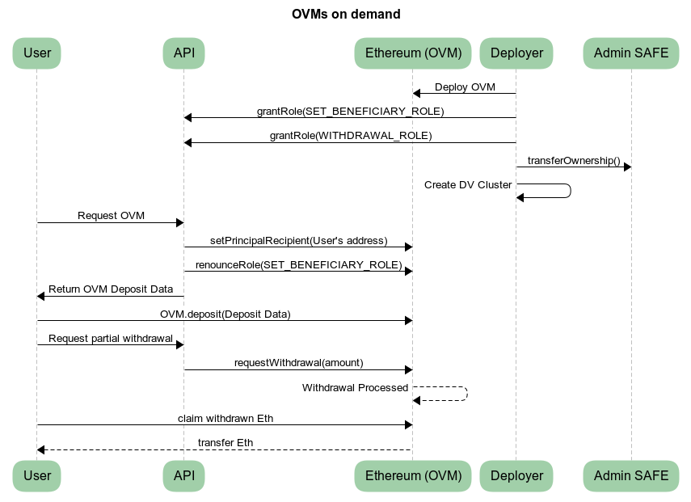

# Validator Pre-Deploy Workflow

A customer opting into staking at an unknown time, is a key trigger for enterprise staking deployments. There are two primary ways these ad-hoc demands are programatically fulfilled, using smart contracts or using/generating the private keys.

- Smart contracts such as an [Obol Validator Manager](../../learn/intro/obol-splits.md#obol-validator-managers) (OVM) can re-assign their (beneficial) ownership; allowing a customer to activate a pre-created deposit for this smart contract.
- A fresh DV cluster can be [created](../../run-a-dv/start/create-a-dv-alone.md), a [DKG invite](../../run-a-dv/start/create-a-dv-with-a-group.md) cam be created for waiting [DV-pods](https://github.com/ObolNetwork/helm-charts/tree/main/charts/dv-pod) ready to partake, a [`charon add-validators`](./add-validators.md) command could be triggered to add extra keys to a running cluster, or [`charon deposit sign`](./alter-withdrawal-addresses.md) could be used to alter an unused validator's withdrawal address.

This guide will focus on the former, managing validators using Obol smart contracts, and their role based access control. This approach requires less coordination for multi-operator setups, and is simpler than creating or interacting with private key material on the fly by a remote trigger.

This guide will demonstrate the key steps in preparing a DV cluster for this type of scenario. 50 blank OVMs will be created, each with 10 `0x02` validator keys (>1m eth capacity) along with 50 blank splitter contracts. Adjust the number of OVMs, splitters, and their key counts for your use case. Administratorship of the OVMs and splitters will be given to a private key that will sit in a secure back end API server, and when a customer triggers an allocation of an OVM, the API server private key will make the necessary updates to an unallocated OVM, and then revoke its control over the smart contracts, leaving them ready for the customer's deposit.

The Hoodi testnet will be used for all examples.

<figure><figcaption></figcaption></figure>
<!-- Need to update the above to reflect ownership going to API, and then from API to admin safe. Also transfer of deposit role to user-->


The following code snippets are minimal examples for the purpose of achieving the desired functionality. These should not be run in production without thorough testing and review.



#### Pre-requisites

To keep the `cast` examples neat, we'll declare the key addresses upfront here, and refer to them as environment variables in each `cast` command.

```sh
# Create a keypair with `cast wallet new`. Put some (hoodi)Eth in the corresponding address. 
# (Make sure you don't commit it to version control!)
export DEPLOYER_PRIVATE_KEY=0xPrivateKeyForADeployer

# You need an RPC for your commands to reach the Ethereum network. Use one for the correct chain.
export RPC_URL=https://ethereum-hoodi-rpc.publicnode.com
#export RPC_URL=https://ethereum-rpc.publicnode.com

# This address will be the in case of emergency break glass address for all OVMs. 
# This address has custody of the funds and can modify all roles. 
# Consider if this address should be the end user, burned outright, 
# or a trusted, high threshold SAFE account in case of issue.
export ADMIN_SAFE_ADDRESS=0xFallbackSafeAddressHere

# The private key corresponding to this address should run in your API service
# This address will have temporary control over the OVM until a User requests it
# Create a keypair with `cast wallet new` and send it some Ether for transaction fees.
export BACKEND_API_ADDRESS=0xPublicAddressForAPIWallet
# The corresponding private key. (Make sure you don't commit it to version control!)
export BACKEND_API_PRIVATE_KEY=0xPrivateKeyForAnAPIWallet

# The address of the OVM factory on Hoodi
export OBOL_VALIDATOR_MANAGER_FACTORY_ADDRESS=0x5754C8665B7e7BF15E83fCdF6d9636684B782b12
# The address of the OVM factory address on **Mainnet**
#export OBOL_VALIDATOR_MANAGER_FACTORY_ADDRESS=0x2c26B5A373294CaccBd3DE817D9B7C6aea7De584

# Pull Split Factory Address
export PULL_SPLIT_FACTORY_ADDRESS=0x6B9118074aB15142d7524E8c4ea8f62A3Bdb98f1
# https://etherscan.io/address/0x6B9118074aB15142d7524E8c4ea8f62A3Bdb98f1#code
```

#### Fee Splitting

A key decision when it comes to preparing a Distributed Validator is how Node Operators and Service providers can be non-custodially compensated for their services. Obol Validator Managers are built to leverage [Splits.org](https://splits.org) split contracts. For this demo, split contracts will be pre-created with the unallocated OVMs, and edited for customers as they appear. You may want to consider smoothing MEV across your customers using a pair of nested splitters. This is described in more detail at the end of the [guide](#appendix-mev-smoothing).

### Contract Deployment

A safe and convenient way to deploy an OVM contract is through the [existing contract factory](https://docs.obol.org/next/learn/readme/obol-splits#obol-validator-manager-factory-deployment).



Run these commands 50 times. (You may need to use `createSplitDeterministic()` with a salt value or use different placeholder recipient addresses for the PullSplits or the command will error due to a split with that configuration already existing)

```sh
# Create an OVM owned by the backend API, with placeholder beneficiary and reward addresses
cast send $OBOL_VALIDATOR_MANAGER_FACTORY_ADDRESS \
  "createObolValidatorManager(address,address,address,uint64)" \
  $BACKEND_API_ADDRESS $BACKEND_API_ADDRESS $BACKEND_API_ADDRESS 16000000000 \
  --rpc-url $RPC_URL \
  --private-key $DEPLOYER_PRIVATE_KEY

# Create a PullSplit owned by the backend API
cast send $PULL_SPLIT_FACTORY_ADDRESS \
  "createSplit((address[],uint256[],uint256,uint16),address,address)" \
  (($BACKEND_API_ADDRESS) (1000000) 1000000, 0) $BACKEND_API_ADDRESS $BACKEND_API_ADDRESS \
  --rpc-url $RPC_URL \
  --private-key $DEPLOYER_PRIVATE_KEY
```



```solidity
// SPDX-License-Identifier: MIT
pragma solidity ^0.8.19;

import {Script, console} from "forge-std/Script.sol";

interface IObolValidatorManagerFactory {
    function createObolValidatorManager(
        address owner,
        address beneficiary,
        address rewardRecipient,
        uint64 principalThreshold
    ) external returns (address ovm);
}

contract DeployOVM is Script {
    // Factory contract address (already deployed)
    address constant OBOL_VALIDATOR_MANAGER_FACTORY_ADDRESS = 0x5754C8665B7e7BF15E83fCdF6d9636684B782b12;

    function run() external {
        vm.startBroadcast();

        // Deploy the ObolValidatorManager via the factory
        address ovm = IObolValidatorManagerFactory(OBOL_VALIDATOR_MANAGER_FACTORY_ADDRESS).createObolValidatorManager(
            0xPublicAddressForAPIWallet,  // API wallet
            0xOwnerKeyAddress,            // beneficiary (receives principal)
            0xOwnerKeyAddress,            // rewardRecipient (receives rewards)
            16_000_000_000                // 16 ETH in gwei (recommended principal threshold)
        );

        console.log("ObolValidatorManager deployed at:", ovm);

        vm.stopBroadcast();
    }
}
```




```ts
import {
  createWalletClient,
  createPublicClient,
  http,
  parseAbi,
  parseEventLogs,
} from "viem";
import { privateKeyToAccount } from "viem/accounts";
import { hoodi } from "viem/chains";

// Factory contract address (already deployed)
const OBOL_VALIDATOR_MANAGER_FACTORY_ADDRESS = "0x5754C8665B7e7BF15E83fCdF6d9636684B782b12";

// Minimal ABI for the factory - just what we need to deploy and parse events
const factoryAbi = parseAbi([
  "function createObolValidatorManager(address owner, address beneficiary, address rewardRecipient, uint64 principalThreshold) external returns (address ovm)",
  "event CreateObolValidatorManager(address indexed ovm, address indexed owner, address beneficiary, address rewardRecipient, uint64 principalThreshold)",
]);

// Set up account from private key
const account = privateKeyToAccount("0x...");

// Create a wallet client for sending transactions
const walletClient = createWalletClient({
  account,
  chain: hoodi,
  transport: http("https://ethereum-hoodi-rpc.publicnode.com"),
});

// Create a public client for reading chain data (receipts, logs)
const publicClient = createPublicClient({
  chain: hoodi,
  transport: http("https://ethereum-hoodi-rpc.publicnode.com"),
});

// Deploy the ObolValidatorManager via the factory
const hash = await walletClient.writeContract({
  address: OBOL_VALIDATOR_MANAGER_FACTORY_ADDRESS,
  abi: factoryAbi,
  functionName: "createObolValidatorManager",
  args: [
    "0xPublicAddressForAPIWallet",
    "0xOwnerKeyAddress",
    "0xOwnerKeyAddress",
    16_000_000_000n, // 16 ETH in gwei (recommended principal threshold)
  ],
});

console.log("Transaction submitted:", hash);

// Wait for the transaction to be confirmed and get the receipt
const receipt = await publicClient.waitForTransactionReceipt({ hash });

// Parse the logs to find the CreateObolValidatorManager event
const logs = parseEventLogs({
  abi: factoryAbi,
  logs: receipt.logs,
  eventName: "CreateObolValidatorManager",
});

// Extract the deployed OVM address from the event
const ovmAddress = logs[0].args.ovm;

console.log("ObolValidatorManager deployed at:", ovmAddress);
```




After you have deployed an Obol Validator Manager contract, lets save its address and an example customer address as environment variables to make the rest of the `cast` demo easier. 

```sh
# The created OVM from the factory
export EXAMPLE_OVM_ADDRESS=0xYourRecentlyDeployedOVM

# The created PullSplit from the factory
export EXAMPLE_PULL_SPLIT_ADDRESS=0xYourRecentlyDeployedPullSplit

# An address of a hypothetical new customer
export EXAMPLE_CUSTOMER_ADDRESS=0xCustomerAddress

# A private key of a new customer. (Demo Only. Don't use raw customer private keys in practice)
export EXAMPLE_CUSTOMER_PRIVATE_KEY=0xCustomerPrivateKey
```

### Create the DV Cluster

At this point, you can prepare a DV cluster pointed at these OVMs and split contracts. Use the [`charon create cluster ... --publish`](../../learn/charon/charon-cli-reference.md#create-a-full-cluster-locally) command if you are controlling the validator keys centrally, or [`charon create dkg ... ---publish`](../../learn/charon/charon-cli-reference.md#creating-the-configuration-for-a-dkg-ceremony) if you have a group of operators taking part in the cluster. Comma separate the `--withdrawal-addresses` and `--fee-recipient-addresses` flags with your created OVMs and Pull Splits. Once you complete the key creation, you can load these artifacts into your nodes and get the cluster online and ready for deposits. At this point the last remaining action will be with the API key, which will change the ownership of an OVM to make it ready for deposits.

### Assigning the Contracts to Customers

When a capital allocator (customer) is onboarding, the pre-created contracts can be assigned to that entity. The principal beneficiary address is updated to the entity's preferred address, permissions are allocated to the customer and backend's addresses as needed, and then ownership of the OVMs are transferred or burned.




```sh
# Set the beneficiary address to the customer
cast send $EXAMPLE_OVM_ADDRESS \
  "setBeneficiary(address)" \
  $EXAMPLE_CUSTOMER_ADDRESS \
  --rpc-url $RPC_URL \
  --private-key $BACKEND_API_PRIVATE_KEY

# Modify the splitter to include the customer and service providers (example is 90/10 split customer/admin address)
cast send $EXAMPLE_PULL_SPLIT_ADDRESS \
  "updateSplit(address[],uint256[],uint256,uint16)" \
  ($EXAMPLE_CUSTOMER_ADDRESS,$ADMIN_SAFE_ADDRESS) (900000,100000) 1000000 0 \
  --rpc-url $RPC_URL \
  --private-key $BACKEND_API_PRIVATE_KEY

# Grant the customer the DEPOSIT_ROLE and WITHDRAWAL_ROLE
cast send $EXAMPLE_OVM_ADDRESS \
  "grantRoles(address,uint256)" \
  $EXAMPLE_CUSTOMER_ADDRESS 21 \
  --rpc-url $RPC_URL \
  --private-key $BACKEND_API_PRIVATE_KEY

# [OPTIONAL] If the backend service needs the ability to trigger 
# partial (or full) withdrawals, grant it the WITHDRAWAL_ROLE.
# Warning; This allows this address to selectively charge fees on principal
cast send $EXAMPLE_OVM_ADDRESS \
  "grantRoles(address,uint256)" \
  $BACKEND_API_ADDRESS 1 \
  --rpc-url $RPC_URL \
  --private-key $BACKEND_API_PRIVATE_KEY
```




```solidity
// SPDX-License-Identifier: MIT
pragma solidity ^0.8.19;

import {Script, console} from "forge-std/Script.sol";

interface IObolValidatorManager {
    function setBeneficiary(address newBeneficiary) external;
    function renounceRoles(uint256 roles) external payable;
}

contract SetBeneficiaryAndRenounce is Script {
    address constant OVM_ADDRESS = 0xYourOVMAddress;
    address constant CUSTOMER_ADDRESS = 0xCustomerAddress;

    uint256 constant WITHDRAWAL_ROLE = 0x01;
    uint256 constant DEPOSIT_ROLE = 0x20;

    function run() external {
        // Use the secondary key that was granted SET_BENEFICIARY_ROLE
        vm.startBroadcast();

        IObolValidatorManager ovm = IObolValidatorManager(OVM_ADDRESS);

        // Set the beneficiary to the customer address
        ovm.setBeneficiary(CUSTOMER_ADDRESS);
        console.log("Beneficiary set to:", CUSTOMER_ADDRESS);

        // Allow the beneficiary to deposit and withdraw
        ovm.grantRoles(CUSTOMER_ADDRESS, WITHDRAWAL_ROLE|DEPOSIT_ROLE)
        console.log("Customer assigned deposit and withdrawal roles");
        
        vm.stopBroadcast();
    }
}
```




```ts
import { createWalletClient, createPublicClient, http, parseAbi } from "viem";
import { privateKeyToAccount } from "viem/accounts";
import { hoodi } from "viem/chains";

// The deployed OVM address
const OVM_ADDRESS = "0xYourOVMAddress";

// The customer address to receive principal deposits
const CUSTOMER_ADDRESS = "0xCustomerAddress";

// Role bitmasks from the contract
const WITHDRAWAL_ROLE = 0x01n;
const DEPOSIT_ROLE = 0x20n;

// Combine roles using bitwise OR
const ROLES_TO_GRANT = WITHDRAWAL_ROLE | DEPOSIT_ROLE; // 0x21

const ovmAbi = parseAbi([
  "function setBeneficiary(address newBeneficiary) external",
  "function grantRoles(address user, uint256 roles) external payable"
]);

// Use the backend API key
const account = privateKeyToAccount("0xLessPrivilegedKey...");

const walletClient = createWalletClient({
  account,
  chain: hoodi,
  transport: http("https://ethereum-hoodi-rpc.publicnode.com"),
});

const publicClient = createPublicClient({
  chain: hoodi,
  transport: http("https://ethereum-hoodi-rpc.publicnode.com"),
});

// Set the beneficiary to the customer address
const hash1 = await walletClient.writeContract({
  address: OVM_ADDRESS,
  abi: ovmAbi,
  functionName: "setBeneficiary",
  args: [CUSTOMER_ADDRESS],
});

console.log("Set beneficiary tx:", hash1);
await publicClient.waitForTransactionReceipt({ hash: hash1 });
console.log("Beneficiary set to:", CUSTOMER_ADDRESS);

// Grant the customer the roles to deposit and withdraw
const hash2 = await walletClient.writeContract({
  address: OVM_ADDRESS,
  abi: ovmAbi,
  functionName: "grantRoles",
  args: [CUSTOMER_ADDRESS,ROLES_TO_GRANT],
});

console.log("Grant roles tx:", hash2);
await publicClient.waitForTransactionReceipt({ hash: hash2 });
console.log("Deposit and withdrawal role assigned to customer");
```




### Transferring Ownership


This is a crucial step, and failure to adequately secure the ownership of an OVM could lead to a loss or theft of funds. Ensure you trust the `owner()` address of an OVM before making a deposit.


The last step before the OVM is ready for activation is to transfer the ownership of the OVM away from the backend, to either the customer, or an extremely well secured administrative multi-sig wallet like a [SAFE](https://safe.global) that can intervene to update key values in future if needed. Consider that the owner of an OVM has custodial control over it.




```sh
cast send $EXAMPLE_OVM_ADDRESS \
  "transferOwnership(address)" \
  $ADMIN_SAFE_ADDRESS \
  --rpc-url $RPC_URL \
  --private-key $BACKEND_API_PRIVATE_KEY
```




```solidity
// SPDX-License-Identifier: MIT
pragma solidity ^0.8.19;

import {Script, console} from "forge-std/Script.sol";

interface IObolValidatorManager {
    function transferOwnership(address newOwner) external payable;
}

contract TransferOwnership is Script {
    address constant OVM_ADDRESS = 0xYourOVMAddress;
    address constant SAFE_ADDRESS = 0xYourSafeAddress;

    function run() external {
        vm.startBroadcast();

        IObolValidatorManager(OVM_ADDRESS).transferOwnership(SAFE_ADDRESS);

        console.log("Ownership transferred to SAFE:", SAFE_ADDRESS);

        vm.stopBroadcast();
    }
}
```




```ts
import { createWalletClient, createPublicClient, http, parseAbi } from "viem";
import { privateKeyToAccount } from "viem/accounts";
import { hoodi } from "viem/chains";

// The deployed OVM address
const OVM_ADDRESS = "0xYourOVMAddress";

// The SAFE wallet address to transfer ownership to
const SAFE_ADDRESS = "0xYourSafeAddress";

const ovmAbi = parseAbi([
  "function transferOwnership(address newOwner) external payable",
]);

// The backend API address that currently owns the OVM
const account = privateKeyToAccount("0x...");

const walletClient = createWalletClient({
  account,
  chain: hoodi,
  transport: http("https://ethereum-hoodi-rpc.publicnode.com"),
});

const publicClient = createPublicClient({
  chain: hoodi,
  transport: http("https://ethereum-hoodi-rpc.publicnode.com"),
});

// Transfer ownership to the SAFE
const hash = await walletClient.writeContract({
  address: OVM_ADDRESS,
  abi: ovmAbi,
  functionName: "transferOwnership",
  args: [SAFE_ADDRESS],
});

console.log("Transfer ownership tx:", hash);
await publicClient.waitForTransactionReceipt({ hash: hash });

console.log("Ownership transferred to SAFE:", SAFE_ADDRESS);
```




### Handling Deposits

The capital allocator can now deposit the validators that point to this withdrawal address. The validator keys are held by the [provisioned DV cluster](../../run-a-dv/start/) operators and the deposit data was created during cluster creation. 

This step would normally be through a wallet and web interface. This example using raw private keys is for demo purposes only.


To accurately differentiate reward from principal in an OVM, the OVM contract needs to be invoked during the deposit call. Each OVM has a `deposit()` function exactly matching and wrapping the official deposit smart contract, and should be used for that purpose. 

If a deposit is made not through the OVM, the OVM can be updated with the `setAmountOfPrincipalStake()` method by the `owner` or an address with the `SET_BENEFICIARY_ROLE`.





```sh
cast send $EXAMPLE_OVM_ADDRESS \
  "deposit(bytes,bytes,bytes,bytes32)" \
  0x<pubkey_48_bytes> \
  0x<withdrawal_credentials_32_bytes> \
  0x<signature_96_bytes> \
  0x<deposit_data_root_32_bytes> \
  --value 32ether \
  --rpc-url $RPC_URL \
  --private-key $EXAMPLE_CUSTOMER_PRIVATE_KEY
```




```solidity
// SPDX-License-Identifier: MIT
pragma solidity ^0.8.19;

import {Script, console} from "forge-std/Script.sol";

interface IObolValidatorManager {
    function deposit(
        bytes calldata pubkey,
        bytes calldata withdrawal_credentials,
        bytes calldata signature,
        bytes32 deposit_data_root
    ) external payable;
}

contract Deposit is Script {
    address constant OVM_ADDRESS = 0xYourOVMAddress;

    function run() external {
        // Deposit data (parsed from deposit-data.json)
        bytes memory pubkey = hex"..."; // 48 bytes
        bytes memory withdrawal_credentials = hex"..."; // 32 bytes
        bytes memory signature = hex"..."; // 96 bytes
        bytes32 deposit_data_root = hex"..."; // 32 bytes

        vm.startBroadcast();

        // Deposit 32 ETH to activate a validator
        IObolValidatorManager(OVM_ADDRESS).deposit{value: 32 ether}(
            pubkey,
            withdrawal_credentials,
            signature,
            deposit_data_root
        );

        console.log("Deposit complete - validator activation pending");

        vm.stopBroadcast();
    }
}
```




```ts
import { createWalletClient, createPublicClient, http, parseAbi } from "viem";
import { privateKeyToAccount } from "viem/accounts";
import { hoodi } from "viem/chains";

// The deployed OVM address
const OVM_ADDRESS = "0xYourOVMAddress";

// Deposit data (parsed from deposit-data.json)
const pubkey = "0x..."; // 48 bytes
const withdrawal_credentials = "0x..."; // 32 bytes
const signature = "0x..."; // 96 bytes
const deposit_data_root = "0x..."; // 32 bytes

const ovmAbi = parseAbi([
  "function deposit(bytes calldata pubkey, bytes calldata withdrawal_credentials, bytes calldata signature, bytes32 deposit_data_root) external payable",
]);

// Use the customer key (has DEPOSIT_ROLE), normally do this via wallet connection
const account = privateKeyToAccount("0xCustomerPrivateKey...");

const walletClient = createWalletClient({
  account,
  chain: hoodi,
  transport: http("https://ethereum-hoodi-rpc.publicnode.com"),
});

const publicClient = createPublicClient({
  chain: hoodi,
  transport: http("https://ethereum-hoodi-rpc.publicnode.com"),
});

// Deposit 32 ETH to activate a validator
const hash = await walletClient.writeContract({
  address: OVM_ADDRESS,
  abi: ovmAbi,
  functionName: "deposit",
  args: [pubkey, withdrawal_credentials, signature, deposit_data_root],
  value: 32_000_000_000_000_000_000n, // 32 ETH in wei
});

console.log("Deposit tx:", hash);
await publicClient.waitForTransactionReceipt({ hash: hash });
console.log("Deposit complete - validator activation pending");
```



The validator(s) will enter the activation queue and the `amountOfPrincipalStake` value on the contract will track how much of the balance is considered the principal (owed to the beneficiary). The EL and CL rewards from any targeting validators will be sent to the OVM contract and Pull Split.


### Withdrawing Validator Balance

Compounding validators (0x02 type) can have part of their principal withdrawn from active stake, or be fully exited, via the same `withdraw()` call. Specifying a nonzero value for `amounts` will initiate a partial withdrawal, while 0 will fully exit the validator. You cannot specify an amount that will leave the validator with less than 32 ether in active stake remaining.


There is an important nuance when it comes to partial withdrawals. With an OVM (on the default settings), it will treat a withdrawal of less than 16 ether as rewards rather than principal. **A customer should not withdraw less than this amount of principal or they may be charged fees on it**. Similarly, care must be taken with the `WITHDRAWAL_ROLE`; although it does not allow the changing of who gets rewards, it can cause this 'over-charging' behaviour by doing repeated small withdrawals.






```sh
cast send $EXAMPLE_OVM_ADDRESS \
  "withdraw(bytes[],uint64[],uint256,address)" \
  "[0x<validator_pubkey_48_bytes>]" \
  "[16000000000]" \
  1000000000000000 \
  0xYourRefundAddress \
  --value 0.001ether \
  --rpc-url $RPC_URL \
  --private-key $BACKEND_API_PRIVATE_KEY
```




```solidity
// SPDX-License-Identifier: MIT
pragma solidity ^0.8.19;

import {Script, console} from "forge-std/Script.sol";

interface IObolValidatorManager {
    function withdraw(
        bytes[] calldata pubKeys,
        uint64[] calldata amounts,
        uint256 maxFeePerWithdrawal,
        address excessFeeRecipient
    ) external payable;
}

contract PartialWithdrawal is Script {
    address constant OVM_ADDRESS = 0xYourOVMAddress;

    // Validator public key (48 bytes)
    bytes constant VALIDATOR_PUBKEY = hex"abc123YourValidatorPubkey";

    // Amount to withdraw in gwei (16 ETH)
    uint64 constant WITHDRAWAL_AMOUNT = 16_000_000_000;

    // Maximum fee willing to pay per withdrawal request
    uint256 constant MAX_FEE_PER_WITHDRAWAL = 0.001 ether;

    function run() external {
        vm.startBroadcast();

        bytes[] memory pubKeys = new bytes[](1);
        pubKeys[0] = VALIDATOR_PUBKEY;

        uint64[] memory amounts = new uint64[](1);
        amounts[0] = WITHDRAWAL_AMOUNT;

        IObolValidatorManager(OVM_ADDRESS).withdraw{value: MAX_FEE_PER_WITHDRAWAL}(
            pubKeys,
            amounts,
            MAX_FEE_PER_WITHDRAWAL,
            msg.sender // Excess fee refunded here
        );

        console.log("Partial withdrawal requested for 16 ETH");

        vm.stopBroadcast();
    }
}
```




```ts
import { createWalletClient, createPublicClient, http, parseAbi } from "viem";
import { privateKeyToAccount } from "viem/accounts";
import { hoodi } from "viem/chains";

// The deployed OVM address
const OVM_ADDRESS = "0xYourOVMAddress";

// Validator public key (48 bytes)
const VALIDATOR_PUBKEY = "0xabc123YourValidatorPubkey";

// Amount to withdraw in gwei (16 ETH = 16,000,000,000 gwei)
const WITHDRAWAL_AMOUNT = 16_000_000_000n;

// Maximum fee willing to pay per withdrawal request
const MAX_FEE_PER_WITHDRAWAL = 1_000_000_000_000_000n; // 0.001 ETH

const ovmAbi = parseAbi([
  "function withdraw(bytes[] calldata pubKeys, uint64[] calldata amounts, uint256 maxFeePerWithdrawal, address excessFeeRecipient) external payable",
]);

// Use the secondary key (has WITHDRAWAL_ROLE)
const account = privateKeyToAccount("0xSecondaryKeyPrivateKey...");

const walletClient = createWalletClient({
  account,
  chain: hoodi,
  transport: http("https://ethereum-hoodi-rpc.publicnode.com"),
});

const publicClient = createPublicClient({
  chain: hoodi,
  transport: http("https://ethereum-hoodi-rpc.publicnode.com"),
});

// Request partial withdrawal of 16 ETH
const hash = await walletClient.writeContract({
  address: OVM_ADDRESS,
  abi: ovmAbi,
  functionName: "withdraw",
  args: [
    [VALIDATOR_PUBKEY],
    [WITHDRAWAL_AMOUNT],
    MAX_FEE_PER_WITHDRAWAL,
    account.address, // Excess fee refunded here
  ],
  value: MAX_FEE_PER_WITHDRAWAL, // Send enough to cover the fee
});

console.log("Partial withdrawal tx:", hash);
await publicClient.waitForTransactionReceipt({ hash: hash });
console.log(
  "Partial withdrawal requested - funds will arrive after protocol processes it"
);
```





### Reward Distribution and Splitters

When withdrawals requested eventually exit the beacon chain, they appear on the OVM contract, and should be distributed to the `rewardRecipient` or `principalRecipient` (depending on if they amount to above or below the `principalThreshold` of 16 eth). Calling `distributeFunds()` will push the Ether to the correct address. Split contracts as principal or reward addresses will also need to be distributed from for the funds to land in their ultimate recipients addresses.




```sh
cast send $EXAMPLE_OVM_ADDRESS \
  "distributeFunds()" \
  --rpc-url $RPC_URL \
  --private-key $BACKEND_API_PRIVATE_KEY
```




```solidity
// SPDX-License-Identifier: MIT
pragma solidity ^0.8.19;

import {Script, console} from "forge-std/Script.sol";

interface IObolValidatorManager {
    function distributeFunds() external;
}

contract DistributeFunds is Script {
    address constant OVM_ADDRESS = 0xYourOVMAddress;

    function run() external {
        vm.startBroadcast();

        IObolValidatorManager(OVM_ADDRESS).distributeFunds();
        console.log("Funds distributed to beneficiary and reward recipient");

        vm.stopBroadcast();
    }
}
```




```ts
import { createWalletClient, createPublicClient, http, parseAbi } from "viem";
import { privateKeyToAccount } from "viem/accounts";
import { hoodi } from "viem/chains";

// The deployed OVM address
const OVM_ADDRESS = "0xYourOVMAddress";

const ovmAbi = parseAbi(["function distributeFunds() external"]);

// Anyone can call distributeFunds - no special role required
const account = privateKeyToAccount("0x...");

const walletClient = createWalletClient({
  account,
  chain: hoodi,
  transport: http("https://ethereum-hoodi-rpc.publicnode.com"),
});

const publicClient = createPublicClient({
  chain: hoodi,
  transport: http("https://ethereum-hoodi-rpc.publicnode.com"),
});

// Distribute funds to beneficiary (principal) and rewardRecipient (rewards)
const hash = await walletClient.writeContract({
  address: OVM_ADDRESS,
  abi: ovmAbi,
  functionName: "distributeFunds",
});

console.log("Distribute funds tx:", hash);
await publicClient.waitForTransactionReceipt({ hash: hash });
console.log("Funds distributed to beneficiary and reward recipient");
```




<!-- When EL/CL rewards are to be split among multiple parties, a [splitter contract](https://docs.splits.org/) can be deployed as the target of OVM's `rewardRecipient` to chain the functionality of both contracts. In the case where not all the earning parties are known before OVM deloyment, multiple splitter contracts can be chained to separate mutable vs immutable reward flows.

<figure><figcaption></figcaption></figure>
<!-- 
Staking Rewards [3] OVM
Stake [32] OVM
MEV Rewards [1] Reward Splitter
OVM [32] Capital Allocator
OVM [3] Reward Splitter
Reward Splitter[3.6] Capital Allocator
Reward Splitter[0.4] Fees
-->
<!-- With the above setup, static rewards recipients can be deployed ahead of time while retaining flexibility with the remainder. The second splitter contract could have ownership transferred to the capital allocator after personalization, while maintaining existing contractual reward splits. -->

#### Appendix: MEV Smoothing

If you setup validators where every customer gets their own fee recipient address (and underlying splitter), they will each get proposals rarely (approximately twice per year for a 32 ETH validator). Due to MEV being unequally distributed, only a small number of proposals in the year contain most of the MEV. This means that most of your users will get the median amount of Ether as MEV rather than the average, and may notice a lower APR versus setups that pool and distribute their variable rewards across their users. It may be beneficial for you to instead smooth the MEV being accrued through block proposals across all depositors in the cluster. This can be achieved through two nested split contracts as follows: 

- First create an editable [PullSplit](https://docs.splits.org/core/split-v2) we'll refer to as the Child Split. The owner of this split should be the `$BACKEND_API_ADDRESS`. 
- Next create a second PullSplit we'll refer to as the Parent Split. It can be immutable if preferred. It should send the majority of its inflow to the Child Split, and some amount to a set of addresses that receive operating fees for the cluster. 
- Set the parent split as the `--fee-recipient-address` for all validators in the cluster. This means all proposal rewards for the cluster will go to this address.
- When a customer makes a deposit, use the `$BACKEND_API_PRIVATE_KEY` to update the Child Split to proportionally reflect the eth provided by all customers to the cluster. 
- As proposals by the validators earn tips and MEV, this collects on the Split Contracts. Distributing these rewards sends the ether to the fee recipients and customers.