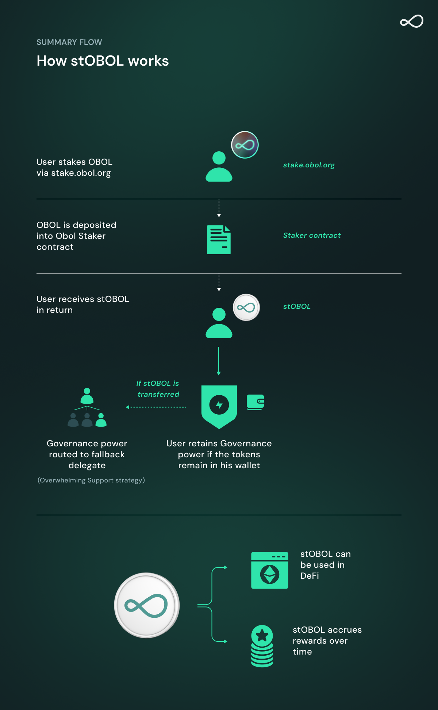

# Staking & stOBOL

## Overview

Staking allows OBOL token holders to participate in governance while earning rewards. When you stake OBOL, you receive a liquid staking token called stOBOL. This token is transferable, composable in DeFi, and earns staking rewards while maintaining governance power, as long as it remains in the same address that originally staked the OBOL Tokens. It represents a flexible and powerful tool to both support the network and engage in the broader ecosystem.

stOBOL unlocks new opportunities for participation. It is yield-bearing, enables seamless governance engagement, and is expected to be increasingly integrated across DeFi platforms. If it is transferred elsewhere, direct delegation is removed and governance power is reassigned using a protective fallback strategy, preventing governance attacks.

### To Recap

* stOBOL is a liquid staking token received when you stake OBOL.
* It allows users to earn staking rewards which auto-compound while retaining governance power.
* stOBOL is fully transferable (ERC-20) and can be used in DeFi (e.g., as collateral).

## Key Concepts

| **Feature**               | **OBOL**                              | **stOBOL**                                                                                               |
| ------------------------- | ------------------------------------- | -------------------------------------------------------------------------------------------------------- |
| **Governance voting**     | ✅ (direct or delegated)               | ✅ (only if kept on original staking address, otherwise governance power reallocated to default strategy) |
| **Transferable**          | ✅                                     | ✅                                                                                                        |
| **Used in DeFi**          | ✅ (less efficient, not yield-bearing) | ✅ (yield-bearing)                                                                                        |
| **Earns staking rewards** | ❌                                     | ✅                                                                                                        |

## Delegation & Governance

Governance power is fundamentally tied to the OBOL Token. When OBOL is staked, the governance power does not transfer to stOBOL itself but remains associated with the underlying staked OBOL. stOBOL serves as a representation of that staked position, surfacing its governance power **only while being held in the same address** that originally staked the OBOL.

If stOBOL is transferred to another address or smart contract, governance power is not automatically preserved. Instead:

* By default, the governance power is reassigned to the **Overwhelming Support** auto-delegate strategy.
* However, the receiving address or smart contract **can explicitly delegate** the voting power of its stOBOL to a delegate of choice, if such functionality is supported.

This design ensures that governance power follows clear, transparent rules:

* **No double-counting**: the OBOL held in the staking contract is not counted separately from the stOBOL in circulation.
* **No governance arbitrage**: someone cannot gain voting rights simply by borrowing or acquiring stOBOL without also controlling the original staking delegation.

If stOBOL is used in DeFi protocols (e.g., as collateral on Morpho), governance power defaults to the Overwhelming Support strategy unless the protocol itself implements explicit delegation support for pooled stOBOL assets.

## How the Overwhelming Support Strategy Works

When a liquid staking token (like stOBOL) is transferred, any previous delegation is removed. To prevent this from harming quorum or enabling governance attacks, the system can route that voting power through an automatic fallback strategy. The first strategy implemented is called the "Overwhelming Support" strategy. This fallback strategy only casts votes using its accrued governance power **in favor** of a proposal when all the following conditions are met:

* **Sub-quorum reached:** At least 66% of the quorum is already met by FOR votes (`subQuorumBips = 66%`).
* **High support threshold:** At least 90% of votes cast so far are FOR votes (`supportThreshold = 90%`).
* **Within final voting window:** The proposal is within \~2.5 days of its deadline (`votingWindow = 14400` blocks).

If all three criteria are met, the strategy casts its voting power FOR the proposal. If not, it abstains.

This ensures that fallback voting power (from transferred stOBOL) is only used to support proposals that already have overwhelming community backing. It avoids influencing contentious or split decisions, protecting governance neutrality and reducing capture risk.

This model preserves network governance while allowing for stOBOL to flow through DeFi protocols.

Other strategies can be proposed via governance.

## Summary Flow

1. OBOL is staked and stOBOL is minted to the staker’s address.
2. While stOBOL remains with the same address, governance power is retained and delegated as usual.
3. If stOBOL is transferred, governance power is removed and reassigned via the "Overwhelming Support" strategy. Other strategies can be proposed via governance.

<figure><figcaption></figcaption></figure>

## Additional Notes

* You can stake and unstake OBOL via [stake.obol.org](https://vote.obol.org/stake).
* Voting and delegation are managed at [vote.obol.org](https://vote.obol.org/).

As the protocol evolves, new strategies or staking configurations may be introduced through DAO governance. Feedback from the community helps inform these decisions.

Have questions? Join our [Discord](https://discord.gg/n6ebKsX46w) or visit the [Governance Forum](https://community.obol.org).

***

_This page will evolve as more staking strategies and integrations are launched._
