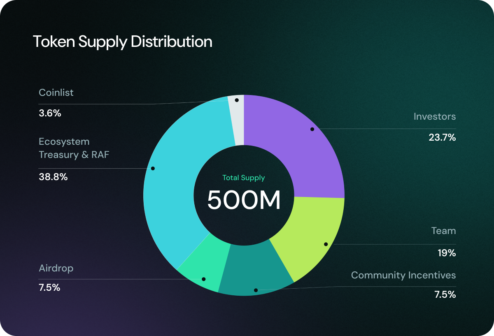
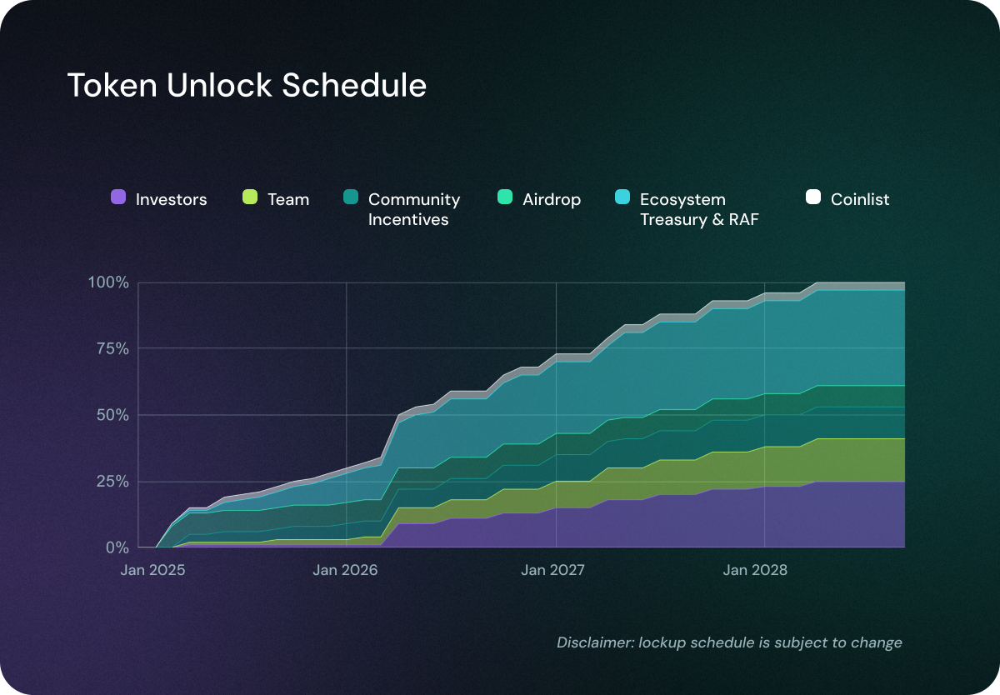

# Token Distribution & Liquidity

## Token Distribution

The total supply is capped at 500 million tokens. The full supply is not immediately circulating and tokens will unlock over the coming months and years.

<figure><figcaption></figcaption></figure>

### **Ecosystem Treasury & Retroactive Funding (RAF) | 38.8%**

A significant portion of OBOL Tokens are allocated to the ecosystem treasury to drive innovation and decentralization. These funds support different initiatives, for example, [**SQUAD Goals**](https://community.obol.org/t/oip-3-obol-collective-2025-goals-proposal/)**, Grants & Incentives Funding** contributors who help to the growth of the protocol and the broader Collective and [**Retroactive Funding (RAF)**](https://docs.obol.org/community-and-governance/governance/raf)**,** rewarding contributions that have positively impacted the Obol Collective. Over time, the Obol Association plans to give additional control over these tokens to the community.

### **Investors | 23.7%**

Early investors played a key role in bringing the Obol Collective to life. This allocation ensures that individuals and entities that provided early financial support are fairly rewarded while adhering to best practices in responsible token vesting.

### **Team | 19%**

To attract and retain top-tier talent, a portion of tokens is reserved for core contributors, founders, and developers. This allocation aligns with the long-term vision of the project and is subject to a lock-up period similar to the one of investors.

### **Community Incentives | 7.5%**

To promote awareness and adoption, OBOL tokens will be used for user-focused initiatives that drive adoption of Obol DVs. The first of these initiative is the [Obol Incentives Program.](https://obol.org/incentives)

### **Airdrop | 7.5%**

As a community-first initiative, Obol has rewarded early contributors and supporters through a retroactive airdrop. This ensures ongoing participation in the Collective and strengthens the decentralized operator ecosystem. For more information about the Airdrop distribution, please [see this blog article](https://blog.obol.org/airdrop/).

### **Public Sale via Coinlist | 3.6%**

To ensure broad and fair token distribution, a portion of OBOL Tokens have been made available through a [Coinlist public sale](https://coinlist.co/obol) at better terms than investors. 50% of tokens purchased in the token sale will be fully unlocked and transferable at TGE, followed by a 12 month linear unlock for the remainder of the tokens.

## Token Liquidity

Once the token becomes transferable, the community will be able to track the distribution schedule and observe how the circulating supply increases over time according to the structured unlock plan.

<figure><figcaption></figcaption></figure>
