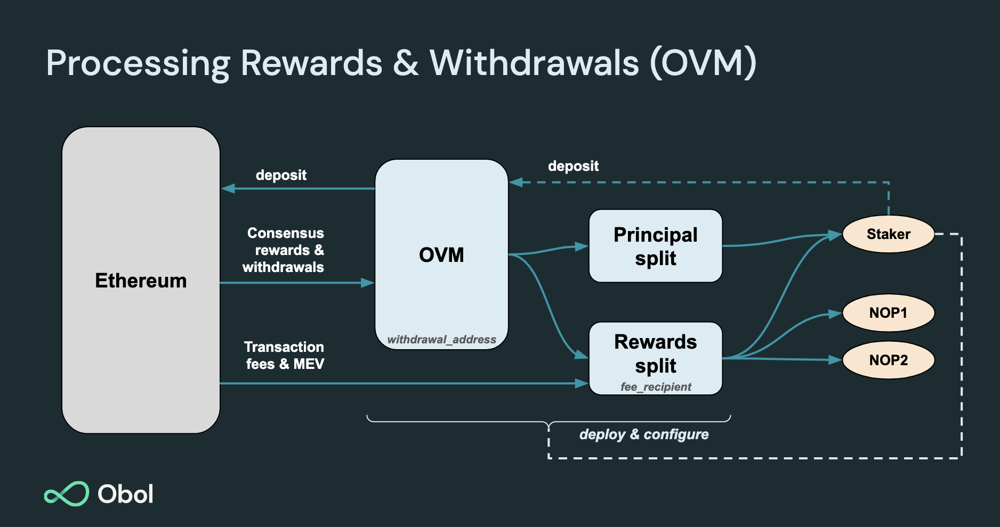

# Obol Splits

Obol develops and maintains a suite of smart contracts for use with Distributed Validators and their surrounding ecosystem of decentralised infrastructure. These contracts include:

* Reward Splitting contracts: Contracts to split ether (and tokens) across multiple entities. Developed by [Splits.org](https://splits.org/)

Key Design Principles the Obol Smart Contract suite include are:

- That they are secure. All [released](https://github.com/ObolNetwork/obol-splits/releases/) Obol Splits products are [audited by high quality security teams](../../advanced-and-troubleshooting/security/overview.md#list-of-security-audits-and-assessments).
- They are not upgradeable.
- They are self-soverign. Any permissioned actions, such as withdrawal, exit, or operator rotation, are controlled by the user, not an unaccountable set of third parties with the ability to upgrade your contracts behaviour.
- They do not require a token to function.
- They are oracle-free. (Unless you intend to leverage a [swapper](https://docs.splits.org/core/swapper)).
- They divide the reward ether from principal ether such that staking providers can be paid a percentage of the _reward_ they accrue for the principal provider rather than a percentage of _principal and reward_.
- That rewards can be withdrawn in an ongoing manner without exiting the validator. (Some conditions apply).

## Optimistic Withdrawal Recipient[​](https://docs.obol.org/learn/intro/obol-splits#optimistic-withdrawal-recipient)  

<figure><figcaption></figcaption></figure>

Optimistic Withdrawal Recipients (OWRs) **are the predecessor to Obol Validator Managers**. The primary addition with Validator Managers is the role-based control over validator withdrawals, exits and consolidations.

Optimistic Withdrawal Recipients allow for the separation of reward from principal, as well as permitting the ongoing withdrawal of accruing rewards.

An Optimistic Withdrawal Recipient [contract](https://github.com/ObolNetwork/obol-splits/blob/main/src/owr/OptimisticWithdrawalRecipient.sol) takes three inputs when deployed:

* A _principal_ address: The address that controls where the principal ether will be transferred post-exit.
* A _reward_ address: The address where the accruing reward ether is transferred to.
* The amount of ether that makes up the principal.

This contract **assumes that any ether that has appeared in its address since it was last able to do balance accounting is skimming reward from an ongoing validator** (or number of validators) unless the change is > 16 ether. This means balance skimming is immediately claimable as reward, while an inflow of e.g. 31 ether is tracked as a return of principal (despite being slashed in this example).


Worst-case mass slashings can theoretically exceed 16 ether, if this were to occur, the returned principal would be misclassified as a reward, and distributed to the wrong address. This risk is the drawback that makes this contract variant 'optimistic'. If you intend to use this contract type, **it is important you fully understand and accept this risk**.

The alternative is to use an splits.org [waterfall contract](https://docs.splits.org/core/waterfall), which won't allow the claiming of rewards until all principal ether has been returned, meaning validators need to be exited for operators to claim their CL rewards.


This contract fits both design goals and can be used with thousands of validators. It is safe to deploy an Optimistic Withdrawal Recipient with a principal higher than you actually end up using, though you should process the accrued rewards before exiting a validator or the reward recipients will be short-changed as that balance may be counted as principal instead of reward the next time the contract is updated. If you activate more validators than you specified in your contract deployment, you will record too much ether as reward and will overpay your reward address with ether that was principal ether, not earned ether. Current iterations of this contract are not designed for editing the amount of principal set.

## Split Contracts[​](https://docs.obol.org/learn/intro/obol-splits#split-contracts) 

Validators have two streams of revenue, the consensus layer rewards and the execution layer rewards. Validator Managers focus on the former, split contracts focus on the latter. They are best used in tandem.

<figure><figcaption></figcaption></figure>

A split, or splitter, is a set of contracts that can divide ether or an ERC20 across a number of addresses. Splits are often used in conjunction with withdrawal recipients. Execution Layer rewards for a DV are directed to a split address through the use of a `fee recipient` address. Splits can be either immutable, or mutable by way of an admin address capable of updating them.

Further information about splits can be found on the splits.org team's [docs site](https://docs.splits.org/). The addresses of their deployments can be found [here](https://docs.splits.org/core/split#addresses).

### Split Controllers[​](https://docs.obol.org/learn/intro/obol-splits#split-controllers) 

Splits can be completely edited through the use of the `controller` address, however, total editability of a split is not always wanted. We recommend using a [SAFE wallet](https://safe.global) to manage the Split.

#### (Gnosis) SAFE wallet[​](https://docs.obol.org/learn/intro/obol-splits#gnosis-safe-wallet) 

A [SAFE](https://safe.global/) is a common method to administrate an editable split. The most well-known deployment of this pattern is the [protocol guild](https://protocol-guild.readthedocs.io/en/latest/3-smart-contract.html). The SAFE can arbitrarily update the split to any set of addresses with any valid set of percentages.

## Deployments

### Obol Lido Split Factory Deployment [**​**](https://docs.obol.org/learn/intro/obol-splits#ols-factory-deployment)

The `ObolLidoSplit` contract is deployed via a [factory contract](https://github.com/ObolNetwork/obol-splits/blob/main/src/lido/ObolLidoSplitFactory.sol). The factory is deployed at the following addresses on the following chains.

| Chain   | Address                                                                                                                       |
| ------- | ----------------------------------------------------------------------------------------------------------------------------- |
| Mainnet |          |
| Hoodi  | [0xb633CD420aF83E8A5172e299104842b63dd97ab7](https://hoodi.etherscan.io/address/0xb633CD420aF83E8A5172e299104842b63dd97ab7)  |
| Holesky |  |
| Sepolia |  |

### OWR Factory Deployment [**​**](https://docs.obol.org/learn/intro/obol-splits#owr-factory-deployment)

The `OptimisticWithdrawalRecipient` contract is deployed via a [factory contract](https://github.com/ObolNetwork/obol-splits/blob/main/src/owr/OptimisticWithdrawalRecipientFactory.sol). The factory is deployed at the following addresses on the following chains.

| Chain   | Address                                                                                                                       |
| ------- | ----------------------------------------------------------------------------------------------------------------------------- |
| Mainnet | [0x119acd7844cbdd5fc09b1c6a4408f490c8f7f522](https://etherscan.io/address/0x119acd7844cbdd5fc09b1c6a4408f490c8f7f522)         |
| Holesky | [0x7fec4add6b5ee2b6c1cba232bc6db754794cb6df](https://holesky.etherscan.io/address/0x7fec4add6b5ee2b6c1cba232bc6db754794cb6df) |
| Sepolia | [0xca78f8fda7ec13ae246e4d4cd38b9ce25a12e64a](https://sepolia.etherscan.io/address/0xca78f8fda7ec13ae246e4d4cd38b9ce25a12e64a) |

## FAQ

### What are Obol Splits?

Obol Splits refers to a collection of composable smart contracts that enable the splitting of validator rewards and/or principal in a non-custodial, trust-minimised manner. Obol Splits contains integrations to enable DVs within Lido with Obol Lido Splits, and Native Staking with Obol Validator Managers.

### Are Obol Splits non-custodial?

Yes. Unless you were to decide to [deploy an editable splitter contract](#can-i-change-the-percentages-in-a-split), Obol Splits are immutable, non-upgradeable, non-custodial, and oracle-free. Obol Validator Managers have owners and Role Based Access Control, but these are self-sovereign and up to the deployer to set and manage. There is no third party with access to or control of your validator unless you grant them such access.

### Can I change the percentages in a split?

Generally Obol Splits are deployed in an immutable fashion, meaning you cannot edit the percentages after deployment. However, if you were to choose to deploy a *controllable* splitter contract when creating your Split, then yes, the address you select as controller can update the split percentages arbitrarily. A common pattern for this use case is to use a Gnosis SAFE as the controller address for the split, giving a group of entities (usually the operators and principal provider) the ability to update the percentages if need be. A well known example of this pattern is the [Protocol Guild](https://protocol-guild.readthedocs.io/en/latest/03-onchain-architecture.html#).

### Are Obol Splits open source?

Yes, Obol Splits are licensed under GPLv3 and the source code is available [here](https://github.com/ObolNetwork/obol-splits).

### Are Obol Splits audited?

The Obol Splits contracts have been audited, though further development has continued on the contracts since. Consult the audit results [here](../../advanced-and-troubleshooting/security/overview.md#list-of-security-audits-and-assessments) and always deploy contracts only from published [releases](https://github.com/ObolNetwork/obol-splits/releases).

### Are the Obol Splits contracts verified on Etherscan?

Yes, you can view the verified contracts on Etherscan. A list of the contract deployments can be found [here](https://github.com/ObolNetwork/obol-splits?#deployment).

### Does my cold wallet have to call the Obol Splits contracts?

No. Any address can trigger the contracts to distribute the withdrawn/skimmed ether, they do not need to be a member of the Split either. You can set your cold wallet/custodian address as the recipient of the principal and rewards, and use any hot wallet to pay the gas fees to push the ether into the recipient address.

### Are there any edge cases I should be aware of when using Obol Splits?

The most important thing to be aware of is what address is the owner of the Obol Validator Manager, whether it has assigned any other addresses any roles, and whether or not the Split contract you are using has been set up with editability and by which address. If a splitter is editable, you should understand what the address that can edit the split does. Is the editor an EOA? Who controls that address? How secure is their seed phrase? Is it a smart contract? What can that contract do? Can the controller contract be upgraded? etc. Generally, the safest thing in Obol's perspective is to use a high threshold multi-sign like a SAFE as the `owner`/`controller`, or to renounce ownership and control entirely, and if in future you are unhappy with the configuration, that you exit the validator and create a fresh cluster with new settings that fit your needs.

Another aspect to be aware of is how the splitting of principal from rewards works using the Optimistic Withdrawal Recipient contract. There are edge cases relating to not calling the contracts periodically or ahead of a withdrawal, activating more validators than the contract was configured for, and a worst case mass slashing on the network. Consult the documentation on the contract [here](../../learn/intro/obol-splits.md#optimistic-withdrawal-recipient), its audit [here](../../adv/security/smart_contract_audit.mdx), and follow up with the core team if you have further questions.
