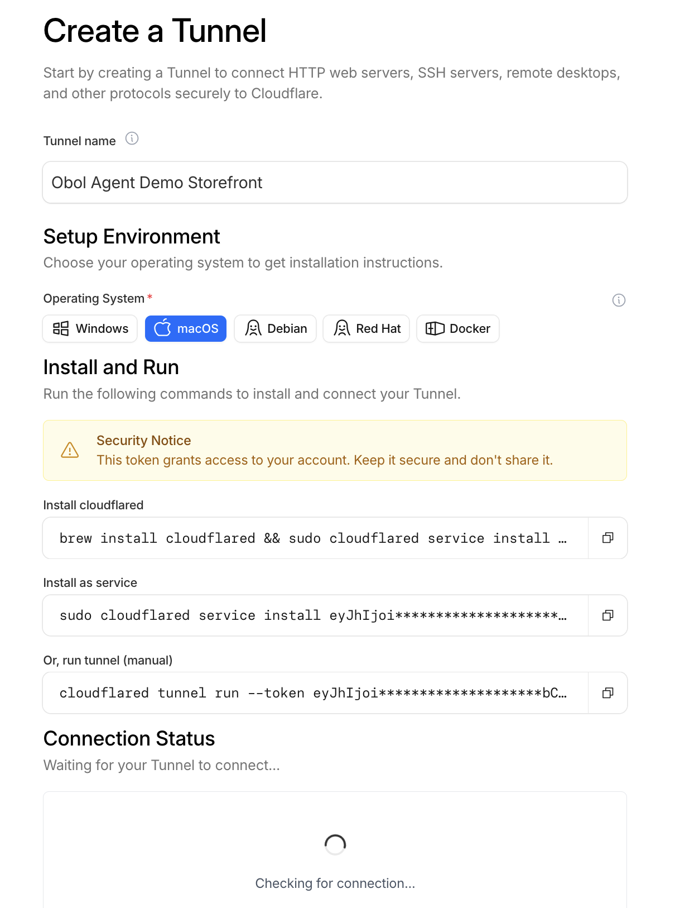
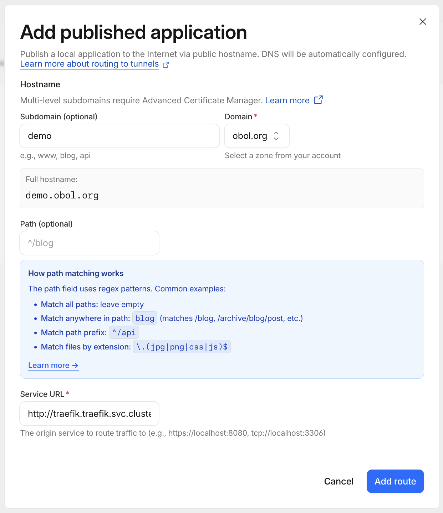

# Set up a permanent URL

By default `obol stack up` brings up a **temporary** Cloudflare quick tunnel. Its `https://<id>.trycloudflare.com` address is great for local testing, but it **changes on every restart** — so anyone who bookmarked it, or any ERC-8004 registration that points at it, breaks the next time your stack comes back up.

Once you're ready to attract buyers, give your stack a **permanent URL** on a hostname you control. Obol does this with a Cloudflare **connector token**: a least-privilege, single-tunnel credential — *not* an account-wide API key. You create the tunnel in the Cloudflare dashboard, and Obol runs the connector for you.


**Prerequisite — a Cloudflare account with a domain.** You need a [Cloudflare](https://dash.cloudflare.com) account (the free plan is fine) with a domain that lives as a **zone** in that account — either bought through Cloudflare Registrar or transferred/added in. The hostname you expose has to live on that domain.

**No domain yet?** You have two options, whichever is easier:

- **In the Cloudflare dashboard** (recommended if you're more comfortable there) — buy a domain via [Registrar](https://dash.cloudflare.com/?to=/:account/registrar) or add an existing one as a zone, then come back here.
- **From the CLI** (optional convenience) — `obol domain search <keyword>`, `obol domain check <name>`, and `obol domain register <name>` wrap Cloudflare Registrar so you never leave the terminal. `obol domain list` shows domains you already own.

Either way, **registering a domain is billable**, so your Cloudflare account needs a saved payment method. The CLI path also needs a scoped Cloudflare **API token** (Account → Domain permission) — note this is a *different* credential from the tunnel connector token below.


## 1. Create the tunnel and copy its token

Open the [Cloudflare Zero Trust dashboard](https://one.dash.cloudflare.com) → **Networks → Tunnels → Create a tunnel**, and choose the **Cloudflared** connector type. On the **Create a Tunnel** screen, give it a name (e.g. `Obol Agent Storefront`), pick your operating system under **Setup Environment**, and copy the token from the **Install and Run** commands — it's the long `eyJ…` value.

<figure><figcaption><p>Name the tunnel, then copy the <code>eyJ…</code> token from the install commands.</p></figcaption></figure>


You do **not** run any of the commands Cloudflare shows — Obol runs the connector inside your cluster, so you don't install `cloudflared` yourself. You only need the token. The easiest is to copy the whole `cloudflared tunnel run --token eyJ…` line and paste it into Obol; it strips the prefix and keeps the token. Treat the token like a password.


## 2. Publish your stack on a hostname

Next, on **Add published application** (the "Route tunnel" / Public Hostname step), choose the **Subdomain** and **Domain** you want (e.g. `demo` + `obol.org` → `demo.obol.org`), leave **Path** empty, and set the **Service URL** to your cluster's Traefik ingress.

<figure><figcaption><p>Pick your hostname, then point <strong>Service URL</strong> at the in-cluster Traefik address.</p></figcaption></figure>


**Set the Service URL to exactly this** — it's the in-cluster address of your stack's Traefik ingress, and it's the same for every Obol Stack:

```
http://traefik.traefik.svc.cluster.local:80
```

Don't use `localhost`, `obol.stack`, or your machine's IP — the connector runs *inside* the cluster, so it must reach Traefik by its Kubernetes service name. Then click **Add route**.


Saving this creates the DNS record and forwards traffic for your hostname into the cluster automatically.

## 3. Hand the token to Obol

```shell
obol tunnel setup --hostname stack.example.com <connector-token>
```

You can paste the bare token, pass it with `--token`, or paste the whole `cloudflared tunnel run --token …` line. If you run `obol tunnel setup` with no token, it walks you through these dashboard steps interactively and prompts for it.

Obol stores the token as an in-cluster secret and runs the connector. Confirm it's live:

```shell
obol tunnel status
```

You should see a **permanent** mode, your hostname, and a connected connector. Your services are now reachable at `https://stack.example.com/...` and survive `obol stack down` / `obol stack up`.


With a stable URL in place, register on-chain so buyers can discover you — see [Build a Profitable Obol Stack](build-a-profitable-stack.md#step-6-get-listed) and [Selling Agent Services](selling-services.md).


## Alternative: browser login (no dashboard)

If you'd rather not use the dashboard, Obol can authenticate a locally-managed tunnel through a browser login instead. This needs the [`cloudflared`](https://developers.cloudflare.com/cloudflare-one/connections/connect-networks/downloads/) binary installed on your machine:

```shell
obol tunnel setup --hostname stack.example.com --management local
```

This opens a browser to authorize cloudflared against your Cloudflare account, then creates the tunnel and DNS route for you. It produces the same kind of permanent URL — the only difference is how the tunnel is managed.

## Troubleshooting

- **`obol tunnel status` shows `waiting_for_connections`** — the connector started but hasn't established a connection yet. Give it a few seconds, or check `obol tunnel logs`.
- **Public check fails / 5xx** — confirm the dashboard Public Hostname's Service is exactly `http://traefik.traefik.svc.cluster.local:80` and that the hostname matches the one you passed to `obol tunnel setup`.
- **`Invalid format for Authorization header`** — you pasted a Cloudflare **API token** or Global API Key instead of the **connector token** from the tunnel's install screen. Use the connector token.
- **Need a fresh quick tunnel instead** — `obol tunnel restart` rotates the temporary URL; `obol tunnel setup` is only for the permanent one.
