# Replacing Operators

There are two methods for changing the operators in a distributed validator cluster:

1. **Edit command** (`charon alpha edit replace-operator`) — Best for swapping a single operator in an existing cluster. This is an in-place, atomic operation that preserves all validators and cluster configuration.
2. **Validator consolidation** — Best when making majority operator changes or merging multiple clusters. This method creates a new target cluster and transfers stake from the source via Pectra consolidation.

## Method 1: Edit Command (Replace Operator)


This is an alpha feature and is not yet recommended for production use.


You can replace an operator in your cluster using the `charon alpha edit replace-operator` command. This operation keeps all validators intact while swapping one operator for another in the cluster.

### Prerequisites

1. Review the `edit replace-operator` command [CLI reference](../../learn/charon/charon-cli-reference.md#replace-an-operator-in-a-cluster).
2. **For continuing operators**: Keep the DV node running during the process and ensure you have a copy of the current cluster lock file and validator private key shares.
3. **For the new operator**: Obtain a copy of the existing cluster lock file from the continuing operators and have your Charon ENR private key file ready.
4. **For the old operator being replaced**: The operator being replaced should NOT participate in the ceremony.
5. Identify the Charon ENR address of the operator you wish to replace and have the new operator's ENR ready.


The ceremony uses a different p2p relay from your running cluster to avoid conflicts. The default relay address is already configured differently, so no special action is required.


### Understanding the Replacement Process

The replace-operator ceremony performs a one-for-one swap:

- The **old operator** is completely removed from the cluster and does not participate in the ceremony
- The **new operator** takes over at the same index position as the old operator
- All **continuing operators** must participate with their existing validator keys
- All validator public keys remain unchanged

This is more convenient than `remove-operators` followed by `add-operators`, as it maintains the cluster size and threshold in a single atomic operation.

### Running the Replace Command

All continuing operators and the new operator must run this command. The old operator being replaced should NOT run the command.

#### For Continuing Operators

```bash
# Standard usage
charon alpha edit replace-operator --old-operator-enr=enr:-JG4QH... --new-operator-enr=enr:-JG4QK...

# Docker version
docker run -u $(id -u):$(id -g) --rm -v "$(pwd):/opt/charon" -w "/opt/charon" obolnetwork/charon:v1.9.0 alpha edit replace-operator --old-operator-enr=enr:-JG4QH... --new-operator-enr=enr:-JG4QK...
```

#### For the New Operator

The new operator being added should run the same command but only needs to provide their private key file and the cluster lock file (they won't have validator keys yet):

```bash
# Standard usage
charon alpha edit replace-operator --old-operator-enr=enr:-JG4QH... --new-operator-enr=enr:-JG4QK... --output-dir=output --lock-file=cluster-lock.json --private-key-file=charon-enr-private-key

# Docker version
docker run -u $(id -u):$(id -g) --rm -v "$(pwd):/opt/charon" -w "/opt/charon" obolnetwork/charon:v1.9.0 alpha edit replace-operator --old-operator-enr=enr:-HW4...UVM --new-operator-enr=enr:-HW4QB-SH7cQ....2A0g6y0
```

#### For the Old Operator Being Replaced

The old operator **should not participate** in the ceremony. Simply do not run the command.


The old operator's ENR and new operator's ENR must be different. The command will fail if they are the same.


### Making the DV Stack Use the New Configuration

The example below is designed for the [CDVN repository](https://github.com/ObolNetwork/charon-distributed-validator-node), but the process is similar for other setups.


The old cluster **must be shut down for at least two epochs**. If you're not sure of the epoch boundary, wait 18 minutes from the original cluster going offline until you turn on the modified cluster. **Failure to heed this warning may result in slashing**.


#### For Continuing Operators and New Operator

1. Stop the current Charon and validator client instances:

```bash
docker compose down
```

2. Back up and remove the existing `.charon` directory, then move the `distributed_validator` directory to `.charon`:

```bash
mv .charon .charon-backup
mv distributed_validator .charon
```

3. Restart the Charon and validator client instances **once at least two epochs of downtime have passed**:

```bash
docker compose up -d
```

#### For the Old Operator Being Replaced

The operator who has been replaced can safely shut down their node after the ceremony completes:

```bash
docker compose down
```

### Edit Command Limitations

- The new cluster configuration will not be reflected on the Launchpad.
- The new cluster configuration will have a new cluster hash, so the observability stack will display new cluster data under a different identifier.
- All continuing operators must have valid validator keys to participate in the replacement ceremony.
- The cluster's threshold value remains unchanged after replacing an operator.
- The new operator's ENR must not already exist in the cluster.
- The old operator's ENR must exist in the current cluster.

---

## Method 2: Validator Consolidation

Validator consolidation is a feature for the Ethereum network, introduced with the **Pectra** network upgrade. It allows a user to "consolidate" multiple validators into a single, new validator. When applied to Obol clusters, this enables transferring staked ETH from a **source cluster** (with its original operators) to a **target cluster** (with a new set of operators).

This method is best suited when:
- You need to replace a majority of operators in a cluster
- You want to merge validators from multiple source clusters into one target cluster
- The change should be driven by the withdrawal address holder (e.g. an ETH allocator) rather than the operators themselves

### How Consolidation Works

- Consolidations can only be performed when the source validator has `0x01` or `0x02` withdrawal credentials and the target validator must be `0x02`. The consolidation transaction must be sent from the withdrawal address defined in the source credentials. The target withdrawal credentials can be any address of choice.
- This process transfers the staked ETH from the old validators to the new one while the stake never leaves the beacon chain. The only partial downtime for the source validator is the standard 27-hour waiting period on the beacon chain before the withdrawal. When compared to fully exiting and re-depositing, consolidation avoids the sweep delay required in that option.

In this guide, we focus on source and target validators that have the same withdrawal address (EOA or contract). Other scenarios supporting differing withdrawal addresses are in development.

**Pros:**

- Can be performed by a withdrawal address holder (who can be a non-operator such as an ETH allocator), without requiring technical knowledge of node operation.
- Very minimal downtime of ~27 hours (256 epochs) on the stake with source validators. Missed rewards are estimated to be around 0.00296 ETH per validator.

**Cons:**

- If the number of validators is very high, even a single day of downtime (even though small) can add up.
- Target validators need to be active. This requires an additional 32 ETH for each target validator the cluster wishes to set up.

This guide assumes you are starting with a source cluster with four existing operators and want to consolidate their validators into a new target cluster with four new operators.

### 1. Prepare the Target Cluster

- **Create a New Cluster:** As the user, first create a new Obol cluster for four new operators of your choice. More details can be found [here](../../run-a-dv/start/create-a-dv-with-a-group.md).
- **Set Withdrawal Address:** Set the withdrawal address for this new cluster to be the same EOA address you used for the source cluster. In future this can be changed to a withdrawal address of your choice.
- **Deploy a New Splitter:** Deploy a new splitter contract dedicated to the new operators of the target cluster.
- **Configure Validators:** Ensure the validators in the new cluster are configured as **compounding validators** with the `0x02` credential type. To enable this make sure to turn the compound toggle on or use the `--compounding` flag if using the CLI directly.

<figure>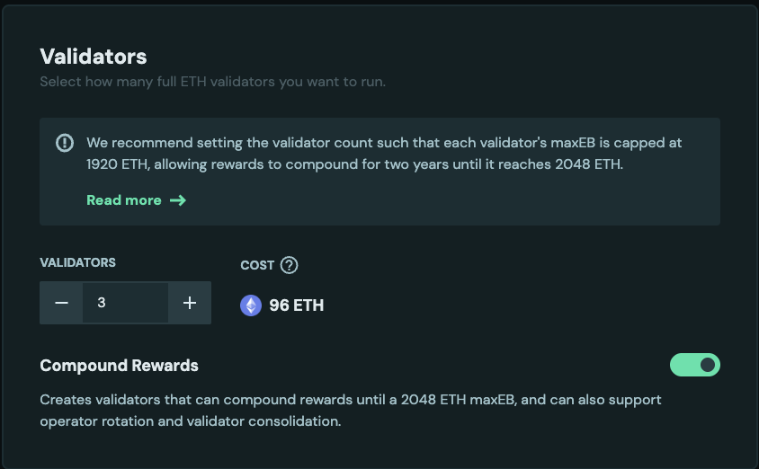<figcaption></figcaption></figure>

- **Run Nodes:** Start the Charon nodes for all operators in the new target cluster. Make sure all the nodes are healthy and ready for deposits. More details [here](../../run-a-dv/running/monitoring.md).
- **Activate Validators:** Activate the target validators by depositing 32 ETH for each. More details [here](../../run-a-dv/running/activate-a-dv.md). The image shows a new operator `0x493...9b1`.

<figure>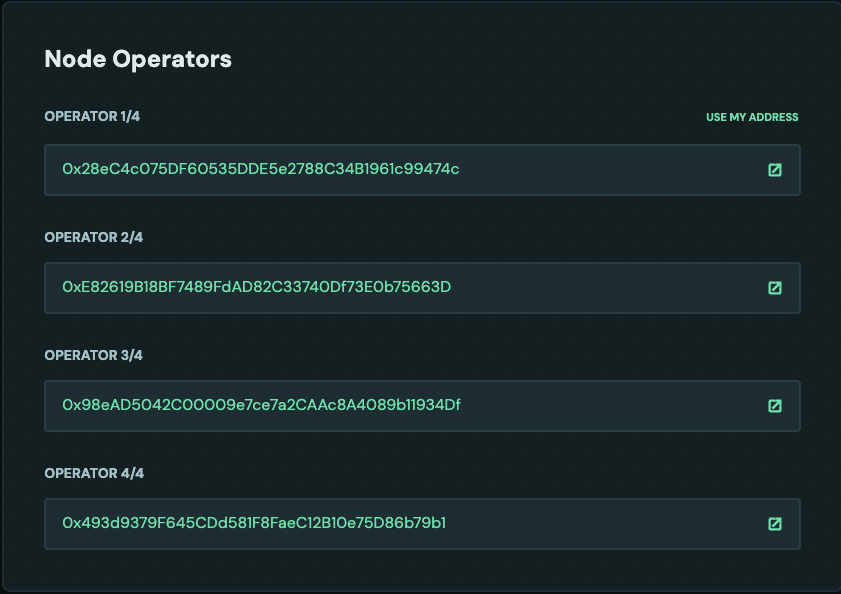<figcaption></figcaption></figure>

### 2. Finalize the Source Cluster

- Have a source cluster ready. Make sure you are connected with the correct withdrawal address. In this case, the operator [`0x28eC4c075DF60535DDE5e2788C34B1961c99474c`](https://hoodi.launchpad.obol.org/operator/0x28eC4c075DF60535DDE5e2788C34B1961c99474c/) is also the withdrawal address.

<figure>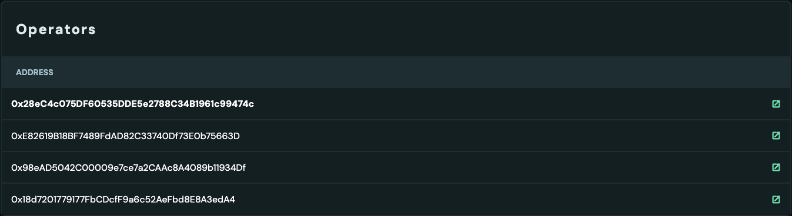<figcaption></figcaption></figure>

<figure><figcaption></figcaption></figure>

- **Distribute Rewards:** Before proceeding, distribute all pending rewards from the source cluster's splitter contract to ensure all financial obligations are settled with the original operators. The rewards should be 0 after rewards are distributed and claimed.

<figure>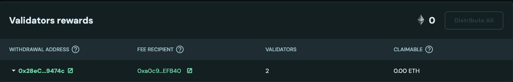<figcaption></figcaption></figure>

### 3. Initiate the Consolidation

- **Access the Migration Tool:** Navigate to the Obol Launchpad migration page by using a URL such as `https://hoodi.launchpad.obol.org/migrate/?withdrawalAddress=your_withdrawal_address`. Alternatively, click the **Migrate** button on a target validator's page within the target cluster dashboard. This **Migrate** button is only clickable for validators where the connected address is the withdrawal address. Make sure the correct address is connected.

<figure>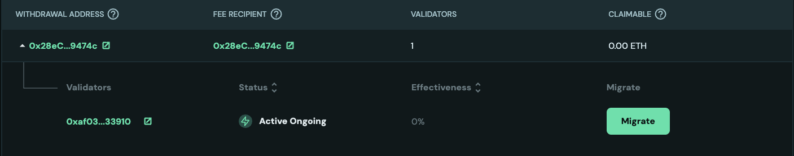<figcaption></figcaption></figure>

- **Select Validators:** On the migration page, select the source validators from the original cluster that you wish to consolidate.


- **Confirm and Consolidate:** Click the **Migrate** button to send the consolidation request.


<figure>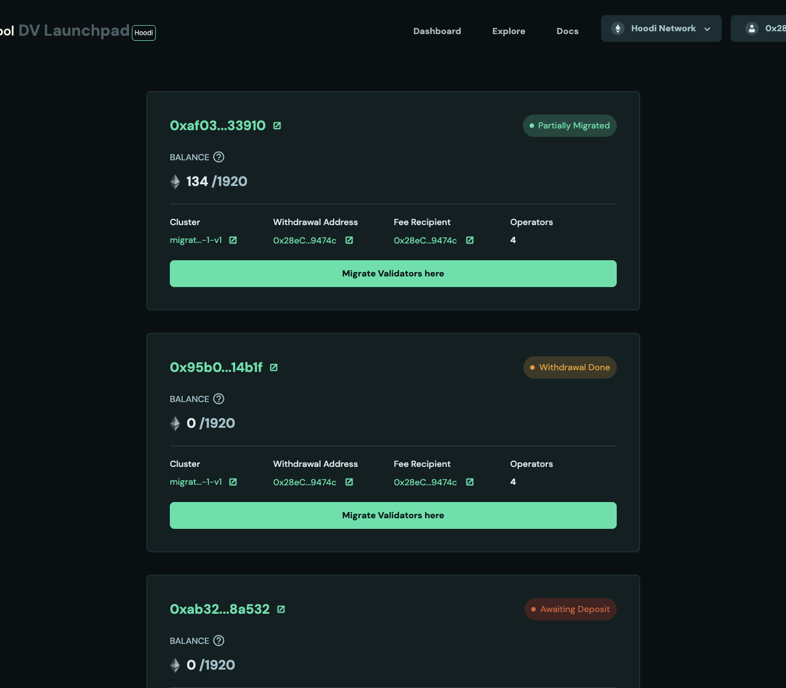<figcaption></figcaption></figure>

### 4. Post-Consolidation Actions


Screenshots are for reference only, your validator balances and performance will differ.


- **Source Validator Exit:** Once the consolidation request is processed by the Ethereum network, the source validators will be set to exit automatically. On [beaconcha.in](https://beaconcha.in) the validator pubkey will show an **exiting** status with consolidation in progress.

<figure>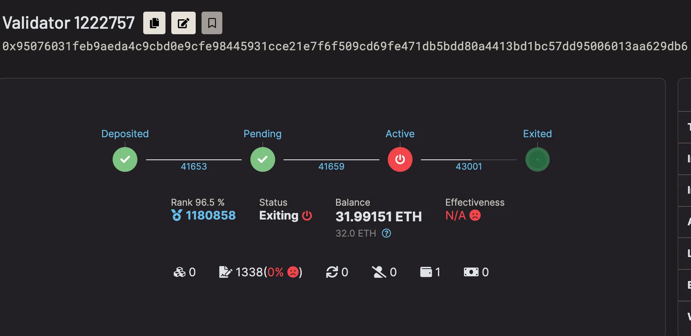<figcaption></figcaption></figure>

<figure>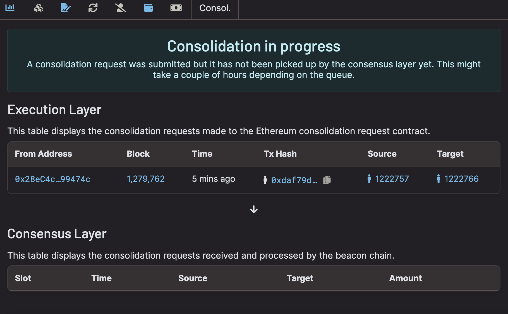<figcaption></figcaption></figure>

- **Waiting Period:** After the exit is complete, the validator enters a ~27 hour waiting period (256 epochs). In the example below the validator is marked **exited** while the withdrawable epoch remains in the future (43257). Once the withdrawable epoch is reached, ETH will be consolidated to the target validator.

<figure>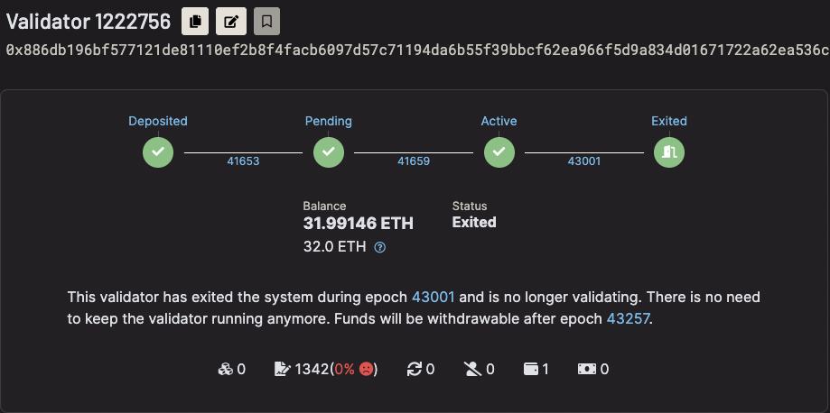<figcaption></figcaption></figure>

- **ETH Transfer:** After the waiting period, the staked ETH from the source validators is automatically consolidated and credited to the target validators in the new cluster.

<figure>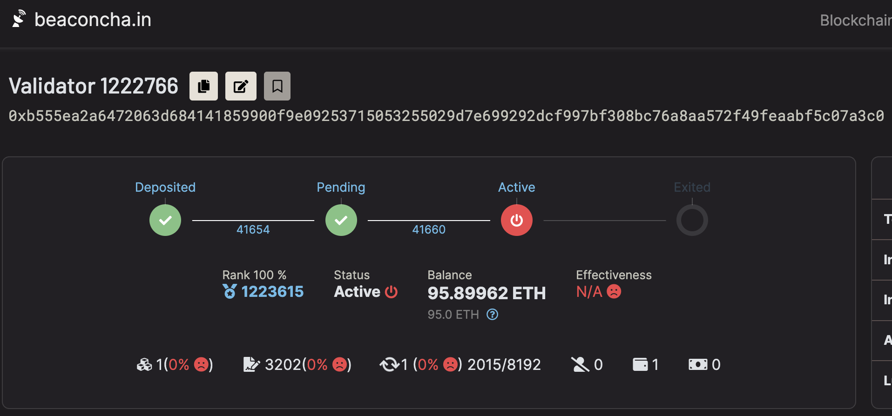<figcaption></figcaption></figure>

- **Wind Down Source Clusters:** Once the source validators have fully exited and funds have settled with the target cluster, you can wind down the original operators.

<figure>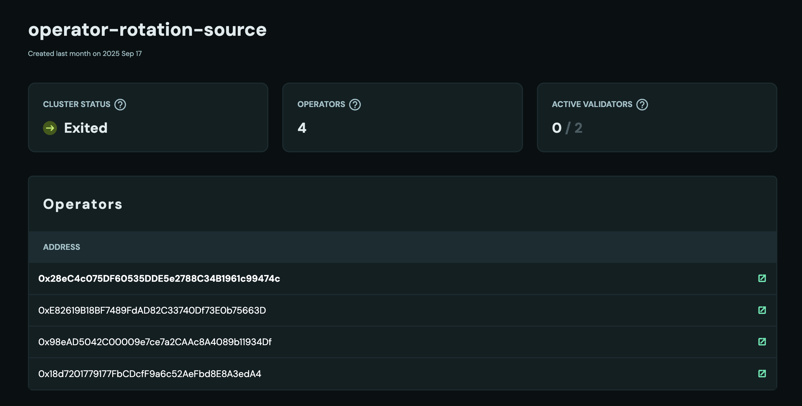<figcaption></figcaption></figure>

**Example clusters used in screenshots:**

- Target cluster: [0x15d1…9e32](https://hoodi.launchpad.obol.org/cluster/details/?lockHash=0x15d113c8c3e3ca1ec24bbdd5c5d8f9065c36f07d9d70c13e9a4efba8a35b9e32)
- Source cluster: [0xF321…2885](https://hoodi.launchpad.obol.org/cluster/details/?lockHash=0xF321443022ABA165FF5635CF71DC9DA0FC29EE91D03117055E97A1F92B5C2885)
