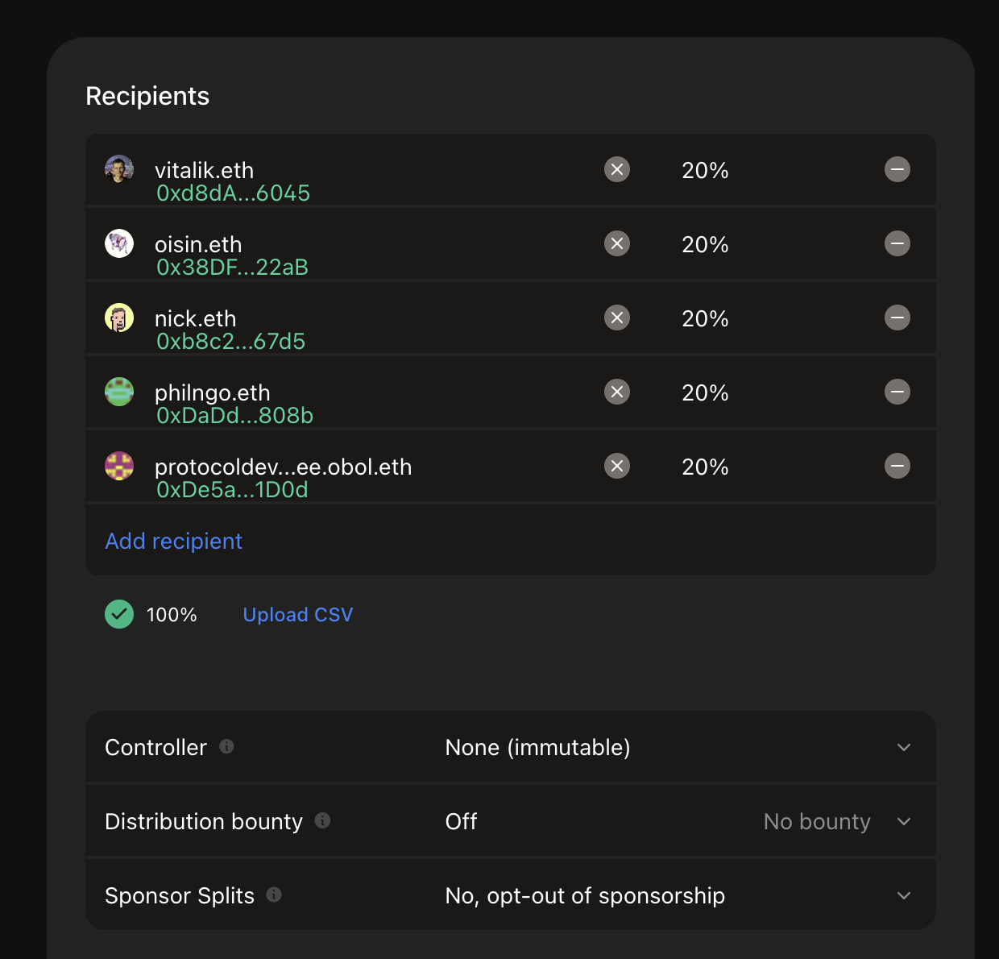
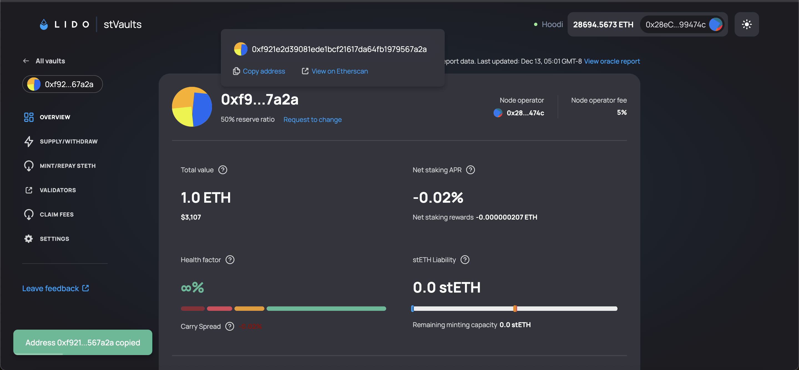
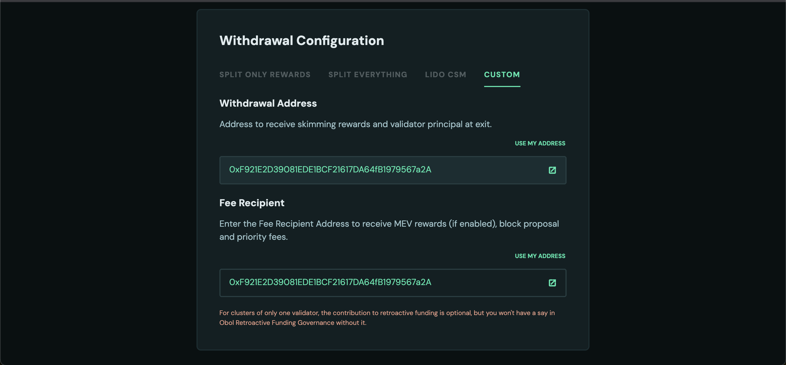

# Node Operator Guide – Operating a Lido V3 stVault with an Obol DV Cluster


**Scope:** This guide is for node operators who operate a **Lido V3 stVault** with an **Obol Distributed Validator (DV) cluster**.

It assumes:

- stVault creation is done via **Lido's stVault UI** or **Lido's stVault CLI**, and
- validator operations (deposit, exit, withdrawal, etc.) are performed using **Lido stVault CLI or Lido's stVault UI** only.

Reserve ratio benefits require **multi-operator DV vaults**. Single-operator setups do not qualify you for improved reserve ratios (though may qualify you for Obol's [Incentive](https://obol.org/incentives) program).


---

## 1. High-Level Flow (Multi-Operator Obol DV Vaults)

At a high level, the lifecycle for a multi-operator Obol DV stVault is:

1. **Create the stVault**
    
    – via **Lido stVault UI** (recommended where available) or **Lido stVault CLI**.
    
2. **Set up governance & fee routing**
    
    – Configure a `GOVERNANCE_SAFE` and `NODE_OPERATOR_SAFE` using Gnosis's [Safe UI](https://app.safe.global/) as well as a `FEE_SPLIT_CONTRACT` using the [splits.org](http://splits.org) UI. 
    
3. **Create and publish the Obol DV cluster**
    
    – Use the `charon create dkg --publish` command or the [DV Launchpad](https://launchpad.obol.org/) to create a multi-operator DV cluster with the vault as both the withdrawal and fee recipient addresses. Use the `--operator-addresses` flag to invite the Node Operators to complete the DKG ceremony.
    
4. **Run and monitor the DV cluster**
    
    – using Obol’s observability stack.
    
5. **Monitor the vault**
    
    – using **Lido stVault CLI** (`contracts dashboard` and `vo` read commands) plus the stVault UI.
    
6. **Distribute rewards and fees**
    
    – from the vault to the split contract, and from the split contract to participants (including Obol).
    

---

## 2. Creating the Vault (UI vs CLI)

You can create a stVault in two ways:

- **Lido stVault UI (recommended)**
    - Hoodi testnet UI: `https://stvaults-hoodi.testnet.fi/`
    - Mainnet stVault UI link will follow Lido’s official docs once live.
- **Lido stVault CLI**
    - Main docs and command reference:
        
        `https://lidofinance.github.io/lido-staking-vault-cli/`
        

The CLI exposes two main entry points you will use:

- `vo` – **vault-oriented commands** (lower-level, contract-centric).
- `contracts dashboard` – **dashboard-oriented commands** (product/UX layer, usually nicer for day-to-day).

**Practical split:**

- Use **`contracts dashboard r overview / health / info` as your primary monitoring entrypoint** (per vault “product”).
- Use **`vo r overview / health / info / roles`** when you need contract-level detail, addresses, or role debugging.


For beacon-chain deposits, validator exits, withdrawals and other stVault operations, use the Lido stVault UI or Lido stVault CLI only.

Do **not** use the Obol Launchpad UI for these validators.


For the rest of this guide we assume a **multi-operator DV vault** with, for example:

- **Cluster size:** 4 operators
- **Cluster limit:** up to ~1,000,000 ETH (subject to Lido risk / tier approvals)
- **Validator max stake:** 1,920 ETH per validator (allowing space for compounding)
- **Total validators:** ~520–600 in a full configuration

These values are **illustrative**; actual limits depend on your and your depositor’s risk framework and governance.

---

## 3. Core On-Chain Addresses & Safes

Before (or alongside) vault creation, set up three core components.

### 3.1 Governance Safe (`GOVERNANCE_SAFE`)

- **Role:** vault owner / governance multi-sig.
- **Where to create:**
    - Mainnet: `https://safe.global/`
    - Hoodi testnet: Protofire Safe UI – `https://app.safe.protofire.io/`
- **Example policy:**
    - 3/4 multi-sig across:
        - client / treasury signers and/or
        - operator representatives.
    - Typically used as:
        - **Vault Owner**
        - **Default Admin / Node Operator Manager**

---

### 3.2 Node Operator Safe (`NODE_OPERATOR_SAFE`)

- **Role:** operational multi-sig for day-to-day validator + vault actions.
- **Where to create:**
    - Mainnet: `https://safe.global/`
    - Hoodi: `https://app.safe.protofire.io/`
- **Example policy:**
    - 3/4 multi-sig across node operators and/or client infra.
- **Typical responsibilities:**
    - Funding the vault
    - Depositing to beacon chain
    - Requesting validator exits
    - Triggering withdrawals
    - Initiating rebalances
    - Minting/burning stETH if allowed by governance
    - Interacting with Lido stVault contracts via CLI

---

### 3.3 Fee Split Contract (`FEE_SPLIT_CONTRACT`)

On **mainnet**, Obol’s protocol fee is enforced via a fee splitting contract:

- Create via the **Splits.org UI**: `https://app.splits.org/`
- Configure:
    - **1% of validator rewards → Obol protocol fee address**
        
        `0xDe5aE4De36c966747Ea7DF13BD9589642e2B1D0d`
        
    - Remaining percentage split between operators according to your commercial terms.

On **Hoodi**, Splits may not be available or may not support that network:

- You may **skip the split contract** on testnet.
- On mainnet, **using a split contract that routes 1% of validator rewards to Obol is required** to earn Obol's incentive rewards. If this vault will be extremely significant, consider reaching out to the Obol core team to discuss the potential for a custom arrangement.

The image below shows using the splits UI to create a split contract where 5% of validator rewards will be distributed equally across the 4 node operators and Obol.

<figure><figcaption>Example split contract configuration</figcaption></figure>


Consider setting the controller for this split contract to `NODE_OPERATOR_SAFE` or `GOVERNANCE_SAFE` to retain the ability to modify it at a later date.


---

## 4. Recommended Vault Parameters & Roles

When creating the vault via UI or CLI, we recommend the following mapping.

### 4.1 Main Settings (Vault Parameters)

- **Node Operator:** `NODE_OPERATOR_SAFE`
    
    Entity responsible for validator operations and day-to-day vault actions.
    
- **Vault Owner:** `GOVERNANCE_SAFE`
    
    Controls vault ownership, high-level parameters, and emergency controls.
    
- **Node Operator Manager:** `GOVERNANCE_SAFE`
    
    Oversees the Node Operator; can be a separate address if required by governance.
    
- **Node Operator Fee Recipient:** `FEE_SPLIT_CONTRACT`
    
    Set **after vault creation** so all node-operator fees route through the splitter.
    
- **Node Operator Fee:** typically **3–10%** (expressed in basis points in the UI / CLI).
- **Confirmation Lifetime:** e.g. **48 hours**
    
    Relevant if `Vault Owner` and `Node Operator Manager` differ; defines how long confirmations are valid for sensitive operations.
    

For the latest flags and options when creating a vault, refer to:

**Lido stVault CLI – `vo` commands**

`https://lidofinance.github.io/lido-staking-vault-cli/commands/vault-operations`

---

### 4.2 Role Assignments & Responsibilities (Recommended)

| Address | Type | Permissions (examples) | Duties (examples) | Notes |
| --- | --- | --- | --- | --- |
| `GOVERNANCE_SAFE` | Multi-sig (e.g. 4/5) | Grant / revoke roles, transfer vault ownership, set confirmation expiry, pause / resume deposits, recover stuck assets, change node operator, set fee rates. | Strategic governance, emergency handling, fee structure oversight, monitoring node-operator performance, asset recovery. | Primary governance. Often also the node operator manager and vault owner. |
| `NODE_OPERATOR_SAFE` | Multi-sig (e.g. 3/4) | Deposit ETH to beacon chain, manage validator operations, trigger withdrawals, request exits, rebalance vault, monitor performance, claim node-operator fees. | Day-to-day vault and validator operations, responding to alerts, maintaining uptime and SLAs. | Single operational entry-point; should follow strict runbooks and operational policies. |
| `FEE_SPLIT_CONTRACT` | Smart contract | Anyone can call **distribute** to disburse the funds. | Receive node-operator fee rewards, splits across participants. | Obol gets 1% fee share via its protocol address; or as per commercial agreement. |

These are **recommendations**, not stVault requirements; adapt to your own governance needs and risk appetite.

---

## 5. Obol DV Cluster Setup (Multi-Operator Only)

After the vault and core addresses exist, you can set up the **Obol DV cluster**.

Follow Obol’s docs for **multi-operator DV setup**:

- **Cluster size:** minimum 4 independent operators recommended
- **Compounding validators:** `true` (recommended for vault integrations).
- **Withdrawal address:** vault withdrawal address.
- **Fee recipient address:** vault / dashboard address.
- **Number of validators:** sized to your capacity and Lido-approved tier.

Obol cluster creation docs:

[Create a DV With a Group](../start/create-a-dv-with-a-group.md)


When generating the cluster lock, use the --publish flag so the cluster lock is published and verifiable by:

- DV participants,
- Lido risk review & DV tier evaluation, and for
- Better support by the Obol Team in troubleshooting cluster issues.


<figure><figcaption></figcaption></figure>

<figure><figcaption></figcaption></figure>

### 5.1 DV Cluster Identification Process

After creating and publishing your Obol DV cluster, you must go through **Lido's identification process** to be classified as an **Obol DV cluster** and qualify for DV-specific tiers with improved Reserve Ratio (RR) and stETH minting limits.

**Why identification matters:**

- **Unidentified clusters** default to the **Default tier** with only a **50% Reserve Ratio** and limited stETH minting capacity.
- **Identified DV clusters** can qualify for **DV tiers** with **Reserve Ratios as low as 2-4%** and significantly higher stETH minting limits.

For detailed tier breakdowns and capital efficiency benefits, see the [Capital Allocator Guide](lido-v3-stvault-for-capital-allocators.md#dvt-tiers).

**The identification process:**

1. Each individual Node Operator in the cluster must complete the identification process (post on Lido Research Forum, complete identification forms).
2. A cluster representative posts a **DV Cluster identification request** on the Lido Research Forum.
3. The representative completes the **DV Cluster Questionnaire** with technical and business information.
4. The stVaults Committee assesses your cluster and assigns a **category and tier grid**.
5. Once identified, your cluster can access DV-specific tiers with improved economics.

**How Obol can help:**

- Obol provides guidance and support throughout the identification process.
- We can help coordinate the cluster identification request and questionnaire completion.
- We assist with technical documentation and cluster structure details required for the assessment.

For detailed information about the identification process, requirements, and tier structures, refer to [Lido's Node Operators Identification documentation](https://docs.lido.fi/run-on-lido/stvaults/node-operators-identification).

---

## 6. Monitoring (DV Cluster & Vault)

### 6.1 Obol DV Monitoring

For DV-specific monitoring (RAVER, attestations, client health, etc.), use Obol’s monitoring stack:

Obol monitoring docs: [Monitoring Your Own Node](../running/monitoring.md), [Sending metrics to Obol](../start/obol-monitoring.md)

Typical components:

- Metrics (e.g. Prometheus) for:
    - attestation success
    - proposer success
    - Charon peer connectivity
    - execution and consensus client health
- Alerts for:
    - missed duties
    - insufficient peers
    - clients offline
    - RAVER dropping below your target (e.g. 98%, if that’s your internal standard)

Operators should agree on:

- shared alert channels (Slack / Telegram / Discord), and
- explicit SLAs (who responds, how quickly, escalation path).

---

### 6.2 Vault Monitoring (Using Lido stVault CLI)

The **Lido stVault CLI** exposes read-only commands that are essential for operators and vault managers.

CLI docs root:

`https://lidofinance.github.io/lido-staking-vault-cli/`

You will typically use:

- **`contracts dashboard` read commands** for primary monitoring, and
- **`vo` read commands** for lower-level details and role inspection.

### 6.2.1 Dashboard-Centric View (Recommended UX)

For everyday operations, prefer the **dashboard** read commands:

```bash
# Dashboard overview
yarn start contracts dashboard r overview <dashboardAddress>

# Dashboard health
yarn start contracts dashboard r health <dashboardAddress>

# Dashboard info (addresses, parameters, vault bindings)
yarn start contracts dashboard r info <dashboardAddress>

```

These provide a product-level view of:

- vault health & status
- key parameters and addresses
- high-level metrics relevant to the specific “vault product”

Docs:

`https://lidofinance.github.io/lido-staking-vault-cli/commands/contracts/dashboard`

---

### 6.2.2 Vault-Level View (`vo` – Advanced / Low-Level)

For underlying vault configuration and debugging, use `vo`:

```bash
# Vault overview (contract-level)
yarn start vo r overview -v <vaultAddress>

# Quick health check
yarn start vo r health -v <vaultAddress>

# Roles and permissions
yarn start vo r roles -v <vaultAddress>

# Core vault info (fee parameters, limits, addresses, etc.)
yarn start vo r info -v <vaultAddress>

```

Docs:

`https://lidofinance.github.io/lido-staking-vault-cli/commands/vault-operations`

In practice:

- **Dashboard commands** → main UX surface for operators.
- **`vo` commands** → used when you need full contract detail or to diagnose odd behavior.

---

### 6.2.3 Performance Metrics (`metrics` namespace)

Use the `metrics` namespace for APR and rewards analysis:

```bash
# Comprehensive statistics (APR & rewards)
yarn start metrics r statistic <dashboardAddress>

# APR history (simplified text mode)
yarn start metrics r charts-apr <dashboardAddress> <reportCount> --simplified

# Rewards distribution charts
yarn start metrics r charts-rewards <dashboardAddress> <reportCount>

```

Docs:

`https://lidofinance.github.io/lido-staking-vault-cli/commands/metrics`

Use these for:

- performance reviews
- sanity-checking expected vs realized APR
- understanding the effect of DV tiers and any strategy layer

---

### 6.3 Example Alerting Rules (Non-Canonical)


The thresholds below are illustrative only.

They are not official Lido nor Obol requirements and should be tuned to your vault's risk profile, product design, and the latest protocol guidance.


Examples of vault-level alerts you might configure:

- **Health factor approaching 100%**
    - Trigger an alert when health factor trends down into a “warning band” you define (for example, somewhere below x% according to your strategy), so you have time to respond before it reaches unsafe levels.
- **High utilization of mint capacity**
    - Alert when utilization ratio is close to full (for example, above your internal high-water mark), indicating the vault is near its minting / leverage limit.
- **Low immediate liquidity**
    - Alert when “available to withdraw” ETH falls below an internal buffer — for instance, less than one or two validators’ worth of ETH, depending on how your product handles withdrawals.
- **Sustained underperformance vs expectation**
    - Alert when net staking APR stays materially below your internal target range for multiple reporting periods (e.g. several `metrics r statistic` runs in a row).
- **Low operational efficiency**
    - Alert when net APR / gross APR (efficiency) drops below your chosen target, signalling that penalties, slashing, or high costs are eroding returns more than expected.

**Cadence (example only):**

- Health & dashboard checks: **at least daily**, ideally via automated alerts.
- Performance statistics (`metrics r statistic`): **weekly**.
- APR / rewards charts (`metrics r charts-apr / charts-rewards`): **monthly or quarterly** reviews.

---

## 7. Deposits, Exits, Withdrawals (Pointers Only)

This guide intentionally **does not duplicate** the full stVault operations surface. For:

- **Beacon-chain deposits** (funding validators),
- **Validator exits**,
- **Triggering withdrawals**,
- **Withdrawing ETH from the vault to treasury**,
- **Minting / burning stETH or wstETH**,

use the **Lido stVault CLI** docs:

- Dashboard write commands (deposits, exits, etc.):
    
    [`https://lidofinance.github.io/lido-staking-vault-cli/commands/contracts/dashboard#write`](https://lidofinance.github.io/lido-staking-vault-cli/commands/contracts/dashboard#write)
    
- Vault / VaultHub / additional commands:
    
    [`https://lidofinance.github.io/lido-staking-vault-cli/category/commands/`](https://lidofinance.github.io/lido-staking-vault-cli/category/commands/)
    

This keeps your operational runbooks aligned with the latest Lido contracts and CLI behaviour.

---

## 8. Fees, Splits & Obol Incentives

### 8.1 From Vault to Fee Splitter

Step 1: disburse **node operator fees** from the vault/dashboard to `FEE_SPLIT_CONTRACT` using the Lido CLI.

1. (Optional) Inspect vault info:
    
    ```bash
    yarn start vo r info -v <vaultAddress>
    ```
    
2. Disburse node-operator fees to the configured `feeRecipient` (your splitter) using the **dashboard write** command:
    
    ```bash
    yarn start contracts dashboard w disburse-node-operator-fee \
      <dashboardAddress>
    ```
    

Dashboard write docs:

[`https://lidofinance.github.io/lido-staking-vault-cli/commands/contracts/dashboard#write`](https://lidofinance.github.io/lido-staking-vault-cli/commands/contracts/dashboard#write)

This moves accrued node-operator fees from the vault to your `FEE_SPLIT_CONTRACT`.

Hoodi link: https://stvaults-hoodi.testnet.fi/vaults/your_vault_address/claim

---

### 8.2 From Splitter to Participants

Step 2: **distribute and claim** via Splits.org:

1. Open the **Splits.org UI**: [`https://app.splits.org/`](https://app.splits.org/)
2. Navigate to the page for your `FEE_SPLIT_CONTRACT` address.
3. Connect your wallet and choose either to:
    - **Distribute** – moves the contract’s balance into recipients’ claimable balances.
    - **Distribute and Withdraw** – moves the contract's balance into each participant's own address or Safe. Skipping their requirement to claim.

Hoodi Link: Not available
Mainnet Link: `https://app.splits.org/accounts/<FEE_SPLIT_CONTRACT>`

---

### 8.3 Obol Rewards (Protocol Incentives)

If the split contract is configured correctly with Obol’s share of validator rewards, **Obol incentives** can be claimed proportionally via the [Obol DV Launchpad](https://launchpad.obol.org/) by the other addresses in the split:

Process:

1. Connect the **recipient wallet / Safe** that's entitled to the reward on the [DV Launchpad](https://launchpad.obol.org/).
2. Click the "Dashboard" button.
3. Claim any available Obol incentives.


The DV Launchpad can also be used by Operators to claim their outstanding wstEth rewards once someone has distributed them from the split contract to make them claimable.


Hoodi Link: [https://hoodi.launchpad.obol.org/cluster/list/](https://hoodi.launchpad.obol.org/cluster/list/)

Mainnet Link: [https://launchpad.obol.org/cluster/list/](https://launchpad.obol.org/cluster/list/)
