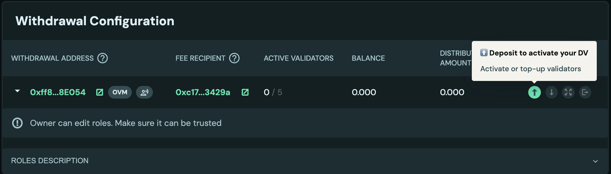
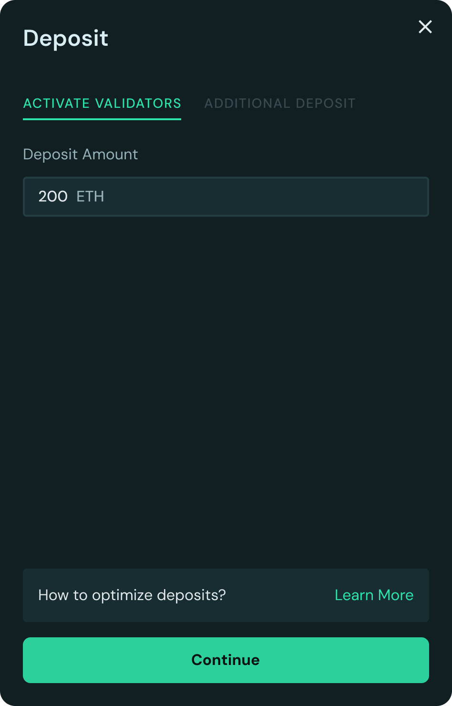
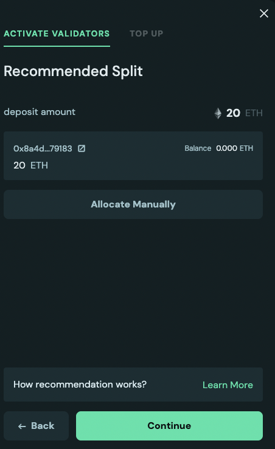
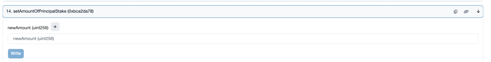

# Activate a DV

If you have successfully created a distributed validator and you are ready to activate it, congratulations! 🎉

Once you have connected all of your Charon clients together, synced all of your Ethereum nodes such that the monitoring indicates that they are all healthy and ready to operate, **ONE operator** may proceed to deposit and activate the validator(s).

The `deposit-data.json` to be used to deposit will be located in each operator's `.charon` folder. The copies across every node should be identical and any of them can be uploaded.


If you are being given a `deposit-data.json` file that you didn't generate yourself, please take extreme care to ensure this operator has not given you a malicious `deposit-data.json` file that is not the one you expect. Cross reference the files from multiple operators if there is any doubt. Activating the wrong validator or an invalid deposit could result in complete theft or loss of funds.


The Ethereum Pectra upgrade enables validators with `0x02` Compounding Withdrawal Credentials to hold balances exceeding 32 ETH and automatically reap the benefits of compounding rewards. The Launchpad provides an intuitive interface to manage these extended balances.

---

## 1. New Deposit Experience Overview

This new flow supports deposits to validators with any standard withdrawal address, including **EOA (Externally Owned Account)** addresses, and streamlines the activation and top-up process.

### A. Critical Distinction (OVM Users MUST Use This Flow)

| Withdrawal Address Type | Recommended Flow | Reason |
| --- | --- | --- |
| **OVM (Obol Vault Manager)** | **MANDATORY:** Deposit via the Cluster Details Page flow. | This ensures the OVM smart contract correctly tracks the deposited amount as principal stake and manages subsequent reward accounting. Bypassing the OVM requires manual accounting adjustments. |
| **EOA (Standard Wallet)** | RECOMMENDED: Deposit via the Cluster Details Page flow. | Allows direct deposit without needing to manually upload a deposit data file. Also supports top-ups. |


🚨 In OVMs, only addresses with `DEPOSIT_ROLE` can perform deposits for activation and top-ups. Read more about how to assign roles [here](../../advanced-and-troubleshooting/advanced/assign-ovm-roles.md).


<figure><figcaption></figcaption></figure>

### B. Initial Deposit Options

There are three strategic ways to break down a large deposit (e.g., 1000 ETH) for activation, all of which use compounding validators:

| Option | Strategy | Pros | Cons |
| --- | --- | --- | --- |
| **1** | **32 ETH + Top-Up** (e.g., 32 ETH + 968 ETH) | Allows any amount, even decimals. Simple, two distinct transactions. | The 968 ETH top-up transaction **must wait** for the initial 32 ETH validator to become Active (opportunity cost). |
| **2** | **Single Activation (>32 ETH)** (e.g., 1000 ETH) | Multiple deposits are bundled into a single multi-call transaction. This eliminates opportunity cost and ensures all ETH yields rewards immediately. | Decimal amounts of ETH are not supported. Transaction gas cost could be high depending upon the amount chosen. |
| **3** | **Activate Multiple Validators** (distributing 1000 ETH) | Similar to Option 2, but leaves more room for individual top-ups later. | Creates more load on nodes due to the higher validator count. |

<figure><figcaption></figcaption></figure>

## 2. Allocation & Submission

After choosing a deposit option, the user specifies the total amount. Pressing continue provides two allocation options:

- **Recommended Allocation:** A suggestion for where the deposit amount should be staked based on an optimization strategy (see Section 3).
- **Manual Allocation:** If the recommendation doesn't fit your preference, you can allocate deposits manually.

Once the allocation is solidified, users review and send transactions. The amount is sent to the deposit queue for activation or top-up based on the chosen strategy.

<figure><figcaption></figcaption></figure>

<figure><figcaption></figcaption></figure>

## 3. Technical Details

### A. How Large Activations (>32 ETH) are Made (Option 2)

When a compounding (`0x02`) validator is created with an amount greater than 32 ETH (e.g., 40 ETH), Charon generates following deposit files (1 ETH, 8 ETH, 32 ETH, 256 ETH). When performing the initial deposit through OVM, the launchpad **bundles multiple deposits into a single multi-call transaction.** When deposits are made via EOA, the batching is done using deposit contracts built by [Pier Two](https://docs.piertwo.com/docs/batch-deposit-contract). Batching results in a slightly higher gas cost than a single 32 ETH deposit. While doing top-ups, any deposit amount can be used.

### B. Recommended Allocation Strategy

The recommended allocation follows this rule - always deposit in validator with highest effective balance less than 1920 ETH. This is to keep the validator count low and benefit from compounding rewards. For example, to deposit 1000 ETH:

- If there is no active validator, we recommend activating with 1000 ETH in a single validator. Or 32 ETH first and 968 ETH later in the same validator.
- If there is an active validator with balance of 920 ETH or less, we recommend depositing in the same validator to reach suggested cap of 1920 ETH or less.
- If there is an active validator with balance of more than 920 ETH, let's say 1200 ETH, we recommend filling this validator to 1920 ETH by adding 720 ETH and using remaining 280 ETH to activate a new validator.

### C. Troubleshooting Top-Ups

If a top-up fails, check the following reasons:

- **Validator Type:** The validator is **not a `0x02` type** and therefore does not support top-ups.
- **Maximum Balance:** The validator has already **reached the maximum suggested balance cap of 1920 ETH**.
- **Status:** There is **no active validator** to receive the top-up amount.

### D. How to Adjust Principal Inside the OVM

When a user bypasses deposits via OVM and deposits directly, the amount of principal stake will not be accrued inside the OVM. This can create problems in the distribute flow which needs principal and rewards to be correctly accounted. OVM allows the Owner to set the correct principal using `setAmountOfPrincipalStake`. Finding the correct amount to set is a manual process. For example, a user deposited 1782 ETH into 3 validators and forgot the amount deposited. If the validators are active or deposits are successful, the user can check on the beacon chain to find deposits into each validator. The total should sum up to 1782 ETH.

<figure><figcaption></figcaption></figure>

## 4. Legacy Deposit Flow (To be Deprecated)

The Legacy Flow is the pre-Pectra experience and should be avoided, especially by OVM users.

- This flow is best suited for activating older `0x01` (BLS) validators.
- It **does not support top-ups** with arbitrary amounts into compounding (`0x02`) validators.
- The user must select the number of validators first, and the total deposit amount is calculated after (Amount * Number of Validators).
- It lacks the integrated Recommended Allocation strategy - it is manually governed by the user.
- If one of the withdrawal addresses is OVM, a warning is displayed with strong suggestions to use the new deposit flow in the cluster page to avoid accounting issues of principal and rewards inside the OVM. Legacy flow will bypass deposits via OVM and directly to validators. As a result, the user will have to manually adjust principal and rewards after. Read more about [how to adjust the principal inside the OVM](#d-how-to-adjust-principal-inside-the-ovm).

### Legacy Deposit Tools

If you need to use the legacy flow (not recommended for OVM users), you can use:

* [Obol Distributed Validator Launchpad](https://launchpad.obol.org/deposit/advisories/)
* [ethereum.org Staking Launchpad](https://launchpad.ethereum.org/)


The activation process can take a minimum of 16 hours, with the maximum time to activation being dictated by the length of the activation queue, which can be weeks.
