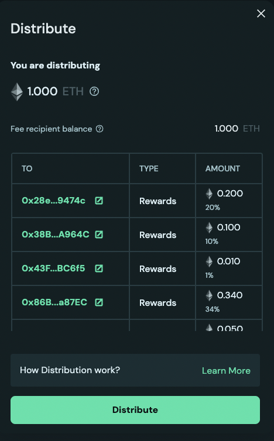
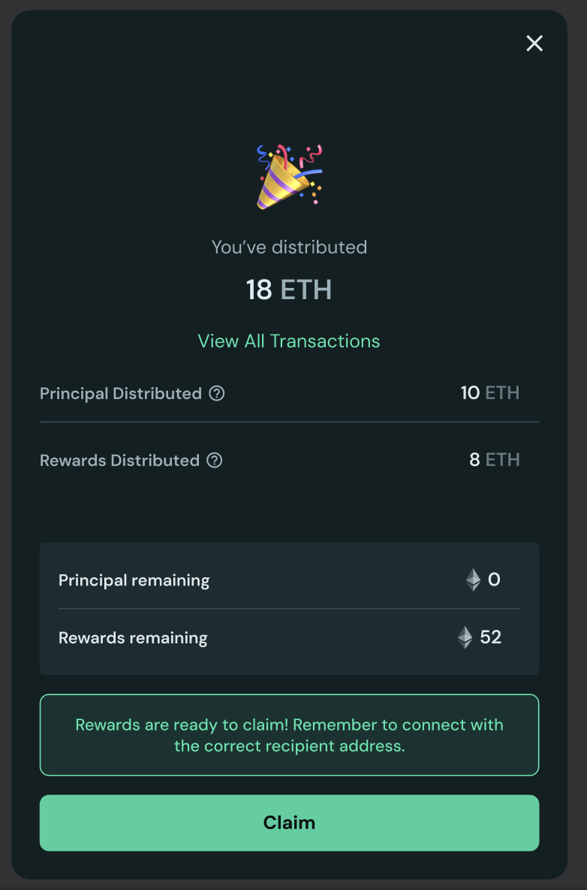

# How Does Distribution Work?

The distribute action allows the user to distribute the funds from OVM and splitters to the claim address. So as a result, the distribute action is only available when either the withdrawal address is an OVM or the fee recipient of the withdrawal configuration is a splitter address. Once amounts are distributed, they can be claimed at the operator page or home page of launchpad.

## Overview

1. The distribution action allows users to transfer the distributable amount as principal or rewards. It comprises of two actions in a single click:
   1. Transfer the amount from OVM balance to Principal recipient or Rewards Recipient depending upon if OVM's Balance has crossed the Principal Threshold.
   2. If the Rewards Recipient is a splitter contract, split the amount according to respective share of addresses in the splitter config and transfer it to the warehouse contract where the amount is ready to claim. The amount from all the various splitter warehouses can be claimed from the main Operator Dashboard.

2. The distribute happens for all the amount available. On clicking distribute, user will see the following modal:
   1. The fields are explained here:
      1. **You are distributing:** This is the sum of OVM Balance + Splitter's Balance that will be distributed. First OVM is distributed and then splitter.
      2. **Total Validator Balance:** Total Validator Balance of all the validators associated to this OVM - principal + rewards
      3. **Principal Threshold:** Amount of ETH required in OVM balance to be classified as Principal to be sent to Principal Recipient. To cross the threshold, withdraw more ETH using withdrawal flow or exit the validators.

<figure><figcaption></figcaption></figure>

   2. The table shows where will the principal or rewards flow to after distribution. In case of when reward recipient is splitter, rewards won't flow directly to addresses in splitter configuration but will be available to claim after operator page on distributions. If a user is part of multiple splitter configuration, it is recommended to distribute across all of them and claim all at once to optimize for gas fees paid. To learn more about the logic of how distribution happens read the [Understanding Distribution in Detail](#understanding-distribution-in-detail) section.

   3. After the distribute transaction is successfully sent, the success page shows the review of amount distributed and new principal + rewards. If rewards were distributed, they will be ready to claim at the dashboard page.

<figure><figcaption></figcaption></figure>

## Understanding Distribution in Detail

1. The distribution starts by looking at total distributable amount (`DA`) that is comprised of OVM's balance (`OB`) and Splitter's balance (`SB`).

2. Upon sending the distribute transaction:
   1. `OB` balance is checked against principal threshold (`PT`) and current principal (`CP`), both of which are tracked in OVM contract.
      1. **If `OB` > `PT` and `CP` > `OB`:** All of `OB` is transferred to principal recipient and tracked principal is debited by `OB`, in other words, new principal in OVM is `CP` - `OB`
      2. **If `OB` > `PT` and `CP` < `OB`:** Since there is not sufficient principal for distributing all of `OB`, only `CP` will be distributed as principal and will be sent to principal recipient. Remainder of `OB` - `CP` will be sent to reward recipient as rewards. This reward recipient could be a splitter contract so new splitter contract balance can be `SBnew` = `SB` + `OB` - `CP`. Current Principal will be set to 0 as no principal is remaining.
      3. **If `OB` < `PT`:** All of `OB` will be sent to reward recipient as rewards. This reward recipient could be a splitter contract so new splitter contract balance can be `SBnew` = `SB` + `OB`
   2. If the reward recipient is a splitter, `SBnew` balance (Previous splitter balance + new ETH from OVM if it was rewards) will be distributed and all of the addresses in splitter config can now claim their reward on the dashboard.

### Distribution Flow Summary

| Condition | OVM Balance (`OB`) vs Principal Threshold (`PT`) | Current Principal (`CP`) vs `OB` | Distribution Result |
| --- | --- | --- | --- |
| **Case 1** | `OB` > `PT` | `CP` > `OB` | All `OB` → Principal Recipient New Principal = `CP` - `OB` |
| **Case 2** | `OB` > `PT` | `CP` < `OB` | `CP` → Principal Recipient `OB` - `CP` → Reward Recipient New Principal = 0 |
| **Case 3** | `OB` < `PT` | N/A | All `OB` → Reward Recipient |


💡 Remember: If the reward recipient is a splitter contract, the distributed rewards will be available to claim on the Operator Dashboard, not sent directly to individual addresses in the splitter configuration.

