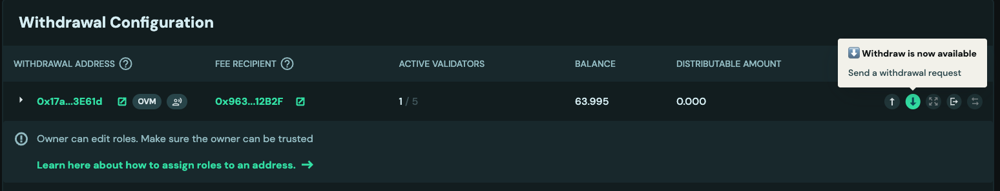
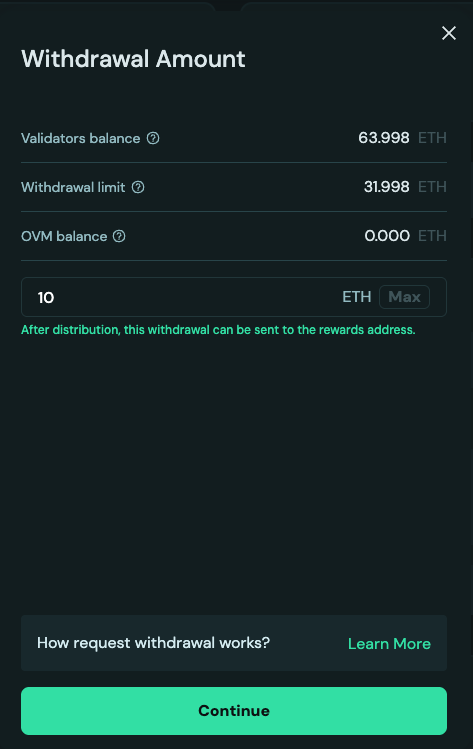
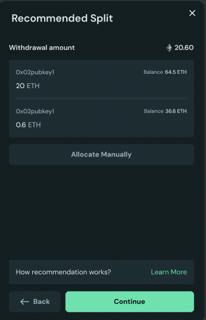
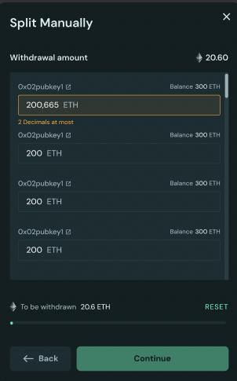

# Request Withdrawal

Post-Pectra update, a new type of validator with 0x02 withdrawal credentials type are supported that can have more than 32 ETH of effective balance. Unlike the validators with a `0x01` withdrawal credentials type, which go through periodic skimming of their consensus rewards through a withdrawal sweep, `0x02` rewards are added to the balance to enable auto-compounding. As a result, there is no automatic skimming of rewards. Users have to explicitly send a transaction to request a withdrawal of their rewards to the beacon chain. OVM simplifies requesting a withdrawal by:

1. Supporting batching of withdrawal requests across multiple validators
2. Helping users distinguish between rewards and principal as long as all deposits are done through OVM's and reward amounts are below the principal threshold

The following steps guide you through how to request a withdrawal from your validators:

## Step-by-Step Withdrawal Process

1. On the cluster details page, go to the validators table. In the actions column, click on the withdraw icon. If the withdrawal address is an OVM, the connected address must have the `WITHDRAWAL_ROLE` to request a withdrawal. If the withdrawal address is an EOA, make sure you are connected with the correct EOA. **Read more about how to assign roles** [**here**](../../advanced-and-troubleshooting/advanced/assign-ovm-roles.md)**.**

<figure><figcaption></figcaption></figure>

1. If the user has sufficient permissions, the withdrawal address is an EOA or an OVM, and the validator is with `0x02` withdrawal credentials, a modal opens allowing the user to specify the total withdrawal amount. The fields in this modal mean the following:
   1. **Validator Balance:** Total balance of all validators under this OVM or EOA
   2. **Withdrawal Limit:** The maximum amount a user can withdraw without triggering an exit. For example, if the validator balance is 100 ETH and 2 validators are active, the withdrawal limit is 100 - (2 × 32) = 36 ETH


💡 When deciding the amount to withdraw, users must pay attention to the amount of ETH in their OVM's balance, pending withdrawals and OVM's principal threshold. These fields together help decide how much to withdraw to reach the principal threshold. Read more about this in the [FAQ section](request-withdrawal.md#3-how-to-decide-initial-withdrawal-amount).


<figure><figcaption></figcaption></figure>

3. Once an amount has been selected, the UI recommends how the withdrawal amount should be split across validators. Read more in the [FAQ section](request-withdrawal.md#2-how-recommendation-for-requesting-withdrawal-works). If you would prefer to allocate specific amounts manually, click on `Allocate Manually`.

<figure><figcaption></figcaption></figure>

4. For manually allocating, users must stay below the withdrawal limit. Users can also choose to exit a validator by withdrawing its entire available balance.

<figure><figcaption></figcaption></figure>

5. Before you confirm, review the post-withdrawal balances of the validators and whether any validators will exit. Upon confirmation, withdrawal request transactions are sent. Once the transaction is accepted, the validator enters the queue awaiting a withdrawal sweep. The waiting period depends on the validator’s position in the current withdrawal queue.

## FAQ

### 1. Why can I not see the ETH in my wallet after I sent a withdrawal request?

If you have successfully sent a transaction to the Ethereum Withdrawal Contract to trigger a partial withdrawal or an exit for your **0x02 validator**, but the ETH is not yet in your wallet, it is usually due to one of the following protocol-level steps.

#### 1. Is your request still in the Partial Withdrawal Queue"?

Unlike older 0x01 validators that are automatically "swept" by the protocol, 0x02 withdrawals are **triggered manually** and therefore enter a First-In-First-Out (FIFO) queue.

* **The Delay:** If many stakers are withdrawing at once, your request must wait its turn.
* **How to check:** Visit a block explorer like [beaconcha.in](https://beaconcha.in/) and look for the **"Partial Withdrawal Queue"** status.

#### 2. Are you in the "27-Hour Cooldown" period?

Every withdrawal request—even after it clears the initial queue—is subject to a mandatory security delay.

* **The Delay:** Approximately **27 hours and 50 minutes** (256 epochs).
* **Why?** This is a safety protocol to prevent rapid "stake-grinding" attacks and ensure network stability. Your ETH will remain on the validator and **continue earning rewards** during this specific window.

#### 3. Did you leave at least 32 ETH in the validator?

For 0x02 validators, you can only withdraw the "excess" balance.

* **The Rule:** You cannot partially withdraw a validator's balance below **32 ETH** while keeping it active. If you requested an amount that would drop your balance below 32 ETH, the protocol may reject the request or only process the amount available above the 32 ETH limit.

#### 4. Is the network experiencing a "Mass Exit" or "High Churn"?

If you are performing a **Full Exit** and not just a partial withdrawal, you are subject to the **Churn Limit**.

* **The Delay:** Ethereum only allows a certain amount of ETH (approximately 256 ETH per epoch) to exit the network at once. During periods of high volatility or institutional exits, this queue can stretch from a few days to **several weeks**.
* **0x01 vs 0x02:** While 0x02 partial withdrawals are usually faster because they skip the "sweep cycle," full exits for both 0x01 and 0x02 validators remain in the same global exit line.

#### 5. Are you checking the right "Arrival" type?

Withdrawals do not arrive as a standard "Transfer" transaction.

* **What to look for:** ETH withdrawals are **"Balance Increases"** provided directly by the protocol. They will appear in the **"Withdrawals"** tab of your address on a block explorer, rather than the "Transactions" or "Internal Txns" tab. Your wallet balance will increase, but you may not see a "Received" notification in some apps.

### 2. How recommendation for requesting withdrawal works?

The recommended approach is to withdraw ETH from the active validator that has the **lowest current ETH balance** until that validator's withdrawal limit is reached.

| **Scenario**   | **Example**          | **Recommendation**                          |
| -------------- | -------------------- | ------------------------------------------- |
| **Goal**       | Withdraw 10 ETH      | Withdraw 10 ETH from the 100 ETH validator. |
| **Validators** | Validator A: 100 ETH | **NOT** the 200 ETH validator.              |
|                | Validator B: 200 ETH |                                             |

While the difference in rewards is usually minimal, this strategy helps to **optimize the effective balance** of your highest-earning validator:

* **Effective Balance:** Validator rewards are calculated based on the "effective balance," which is rounded down to the nearest whole ETH, capped at 32 ETH. The protocol has a **0.5 ETH hysteresis limit** for rounding to the _next_ whole integer. For example, a validator must reach **32.5 ETH** to be treated as having a 33 ETH effective balance (capped at 32 ETH).
* **The Goal:** By withdrawing from the validator with **less ETH**, you ensure the higher-balance validator (the **200 ETH** one in your example) keeps as much stake as possible. Since the 200 ETH validator is already earning more rewards, keeping its balance high gives it the best chance to quickly cross the next **0.5 ETH threshold** needed to potentially boost its effective balance (and therefore its rewards) sooner.

### 3. How to decide initial withdrawal amount?

When initiating a withdrawal, the OVM (Obol Validator Manager) uses the **Principal Threshold** (Tp) to determine whether the withdrawn ETH will be classified as **Principal** or **Rewards** upon the next distribution event.

The key calculation users must understand is the **Projected OVM Balance**—the total ETH that will reside in the OVM once all current and pending transactions are complete. The amount you input in the withdrawal field is the only variable you can control to govern this outcome. Based on your input, the UI provides warnings indicating where the withdrawal will be routed once it succeeds.

#### Core Withdrawal Principle

The decision is based on a comparison between the **Projected OVM Balance** and the **Principal Threshold** (Tp).

**Projected OVM Balance = B\_ovm + W\_pending + W\_current**

Where:

* **B\_ovm:** Current OVM Balance (ETH already in the contract).
* **W\_pending:** Pending Withdrawals (ETH from previous successful transactions that are known to be en route to the OVM).
* **W\_current:** Currently Withdrawing amount (the value the user is inputting).
* **Tp:** Principal Threshold (a fixed ETH value).

#### The Distribution Rules

The OVM classifies the withdrawal based on the **Projected OVM Balance**:

| **Condition**                               | **Formula (Plain Text)**               | **Outcome (Upon Distribution)**         | **Destination**                      |
| ------------------------------------------- | -------------------------------------- | --------------------------------------- | ------------------------------------ |
| **Principal Rule** (Threshold Met/Exceeded) | B\_ovm + W\_pending + W\_current >= Tp | The amount is treated as **Principal**. | Sent to the **Principal Recipient**. |
| **Rewards Rule** (Below Threshold)          | B\_ovm + W\_pending + W\_current < Tp  | The amount is treated as **Rewards**.   | Sent to the **Reward Recipient(s)**. |

#### Example

Assume **Tp = 16 ETH**, **B\_ovm = 10 ETH**, and **W\_pending = 2 ETH**. The current base is 10 + 2 = 12 ETH.

| **Withdrawal Amount (W\_current)** | **Projected OVM Balance** | **Result**                            | **Destination**     |
| ---------------------------------- | ------------------------- | ------------------------------------- | ------------------- |
| **4 ETH** (or more)                | 10 + 2 + 4 = 16 ETH       | 16 ETH >= 16 ETH **(Principal Rule)** | Principal Recipient |
| **3 ETH** (or less)                | 10 + 2 + 3 = 15 ETH       | 15 ETH < 16 ETH **(Rewards Rule)**    | Reward Recipient(s) |

#### Action for Rewards Recipients

If the withdrawal is classified as Rewards:

* **Splitter Contract:** The distribution will trigger a function in the splitter to share the rewards among the configured addresses.
* **EOA (Externally Owned Account):** The amount will be sent directly to the EOA address.
